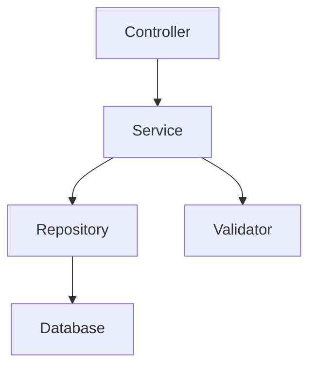
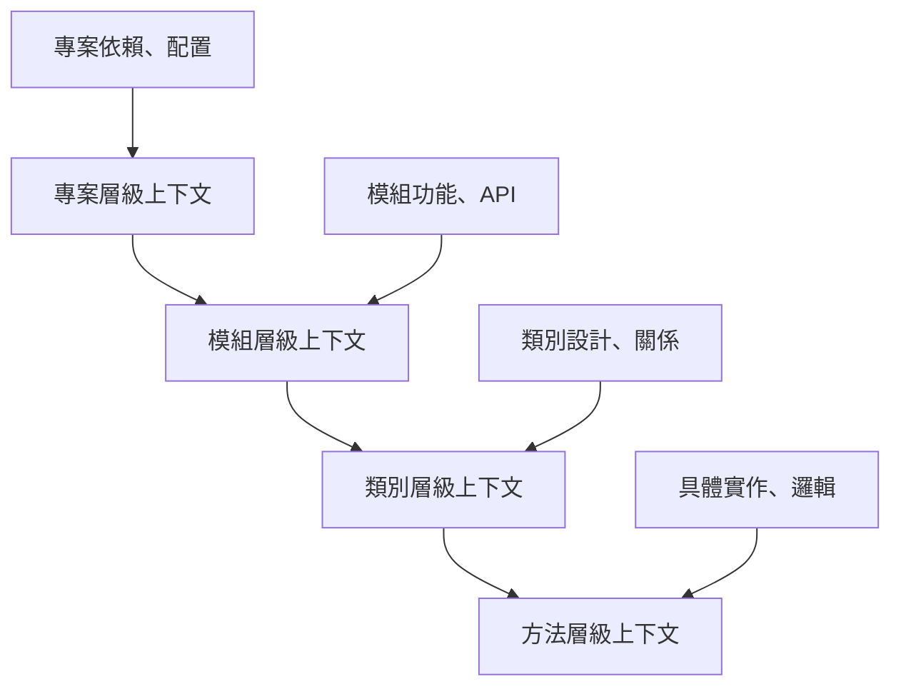

# 第2章：理解上下文 - Cursor AI 的核心機制

## 📚 本章學習目標

完成本章節後，您將能夠：
- 🧠 深入理解 Cursor AI 的上下文機制原理
- 🎯 掌握不同類型的上下文管理技巧
- 🔧 學會優化上下文配置提升 AI 分析效果
- 💡 建立有效的上下文策略框架
- 🚀 實際操作演練上下文管理最佳實踐

---

## 🤖 什麼是 Cursor 的上下文機制？

在開始深入學習 Cursor 的強大功能前，我們必須先理解一個核心概念：**上下文 (Context)**。

> 💡 **關鍵概念**：上下文是 Cursor AI 理解您程式碼的基礎，就像是給 AI 提供的「閱讀材料」，決定了 AI 能否準確理解您的意圖並提供有效協助。

### 🧠 上下文的運作原理

Cursor AI 透過以下方式建立對您程式碼的理解：

1. **程式碼索引**：分析專案結構、函數關係、變數定義
2. **語義理解**：理解程式碼的業務邏輯和設計模式
3. **上下文關聯**：連結相關檔案、函數、類別的關係
4. **智慧推理**：基於上下文進行程式碼分析和建議

### 🎯 為什麼上下文如此重要？

**沒有足夠上下文的情況**：
```javascript
// AI 只看到這段程式碼，無法理解完整邏輯
function processData(data) {
    return data.map(item => transform(item));
}
```

**有充足上下文的情況**：
```javascript
// AI 能理解整個資料處理流程
class DataProcessor {
    constructor(apiClient, validator) {
        this.apiClient = apiClient;
        this.validator = validator;
    }
    
    async processUserData(userData) {
        // 驗證資料格式
        const validatedData = this.validator.validate(userData);
        
        // 轉換資料格式
        const transformedData = validatedData.map(item => 
            this.transformUserItem(item)
        );
        
        // 呼叫 API 儲存
        return await this.apiClient.saveData(transformedData);
    }
    
    transformUserItem(item) {
        return {
            id: item.userId,
            name: item.fullName,
            email: item.emailAddress,
            createdAt: new Date().toISOString()
        };
    }
}
```

---

## 📋 Cursor 的上下文類型

### 1. 🔄 自動上下文 (Automatic Context)

Cursor 會自動收集和管理的上下文資訊：

#### **當前檔案上下文**
- 正在編輯的檔案完整內容
- 游標位置周圍的程式碼片段
- 檔案的匯入/匯出關係

#### **專案結構上下文**
- 資料夾和檔案的組織結構
- 配置檔案（package.json、pom.xml 等）
- 專案依賴關係

#### **語言特定上下文**
- 類別和介面定義
- 函數簽章和文檔
- 型別定義和註解

### 2. 🎯 手動上下文 (Manual Context)

您可以主動提供給 AI 的額外資訊：

#### **檔案加入上下文**
使用 `@文件名` 語法將特定檔案加入上下文：
```
@UserService.java 請分析這個類別的設計模式
```

#### **程式碼片段上下文**
選取特定程式碼片段進行分析：
```java
// 選取這段程式碼並詢問 AI
public class UserRepository {
    @Autowired
    private JdbcTemplate jdbcTemplate;
    
    public User findById(Long id) {
        String sql = "SELECT * FROM users WHERE id = ?";
        return jdbcTemplate.queryForObject(sql, 
            new Object[]{id}, new UserRowMapper());
    }
}
```

#### **描述性上下文**
提供業務邏輯或需求描述：
```
這是一個電商系統的訂單處理模組，需要處理以下業務流程：
1. 驗證庫存
2. 計算價格
3. 建立訂單
4. 發送通知
```

### 3. 🔗 關聯上下文 (Relational Context)

Cursor 自動建立的程式碼關係網絡：

#### **函數呼叫關係**


#### **類別繼承關係**
```java
// Cursor 會理解這些類別間的關係
public abstract class Animal {
    protected String name;
    public abstract void makeSound();
}

public class Dog extends Animal {
    @Override
    public void makeSound() {
        System.out.println("Woof!");
    }
}
```

---

## 🛠️ 實戰演練：上下文管理技巧

### 📍 演練1：檔案上下文管理

讓我們用專案中的範例來練習：

**步驟1：開啟範例專案**
1. 前往 https://github.com/spyua/cloudy_homework
2. 點擊綠色的 "Code" 按鈕
3. 選擇 "Download ZIP" 下載專案壓縮檔
4. 解壓縮到您的工作目錄

**步驟2：在 Cursor 中開啟專案**
1. 開啟 Cursor IDE
2. 點擊 "File" → "Open Folder"（或使用快捷鍵 `Ctrl+K Ctrl+O`）
3. 導航到解壓縮的資料夾，選擇整個 `cloudy_homework` 目錄
4. 點擊 "選擇資料夾" 按鈕
5. 等待 Cursor 建立專案索引（右下角會顯示進度）

> 💡 **PM小提示**：不需要使用終端機！Cursor IDE 的圖形介面就能完成所有操作。

**步驟3：透過檔案總管瀏覽專案結構**
1. 在左側檔案總管中，點擊展開各個資料夾
2. 找到 `src/main/java/com/ck/account/controller/` 目錄
3. 雙擊 `AccountController.java` 檔案開啟

**步驟4：分析控制器類別**
```java
// src/main/java/com/ck/account/controller/AccountController.java
@RestController
@RequestMapping("/api/accounts")
public class AccountController {
    
    @Autowired
    private AccountService accountService;
    
    @GetMapping("/{id}")
    public ResponseEntity<Account> getAccount(@PathVariable Long id) {
        Account account = accountService.findById(id);
        return ResponseEntity.ok(account);
    }
}
```

**🎯 PM專用練習任務**：
1. 將游標放在 `AccountController` 類別名稱上
2. 按 `Ctrl+L` 開啟 Cursor Chat（或點擊右側的聊天面板）
3. 在聊天框中詢問：「請從產品經理的角度分析這個帳戶控制器的業務功能，它提供了哪些API功能？」
4. 觀察 AI 如何從業務角度解釋技術程式碼
5. 進一步詢問：「這個API設計對用戶體驗有什麼影響？」

> 💡 **重點提醒**：重點關注業務邏輯而非技術細節，思考這些程式碼如何支撐產品功能。

### 📍 演練2：多檔案上下文組合

**步驟1：同時開啟相關檔案**
- `AccountController.java`
- `AccountService.java`  
- `Account.java`

**步驟2：使用 @ 語法指定上下文**
```
@AccountService.java @Account.java 
請解釋這些類別之間的協作關係，並建議改善的地方
```

**步驟3：觀察分析結果**
注意 AI 如何：
- 理解類別間的依賴關係
- 識別設計模式
- 提出改進建議

### 📍 演練3：業務邏輯上下文

**情境：分析複雜的業務流程**

```java
// 複雜的訂單處理邏輯
@Service
public class OrderProcessingService {
    
    public OrderResult processOrder(OrderRequest request) {
        // 1. 驗證訂單
        validateOrder(request);
        
        // 2. 檢查庫存
        checkInventory(request.getItems());
        
        // 3. 計算價格
        BigDecimal totalPrice = calculateTotalPrice(request);
        
        // 4. 建立訂單
        Order order = createOrder(request, totalPrice);
        
        // 5. 更新庫存
        updateInventory(request.getItems());
        
        // 6. 發送通知
        sendNotification(order);
        
        return new OrderResult(order.getId(), totalPrice);
    }
}
```

**🎯 提供業務上下文**：
```
這是一個電商平台的訂單處理服務。業務規則如下：
- 訂單金額超過1000元免運費
- VIP 客戶享有95折優惠
- 庫存不足時需要拋出異常
- 訂單建立後需要發送 email 和 SMS 通知
- 支援多種付款方式（信用卡、轉帳、電子錢包）

請分析這個服務的設計並提出改善建議。
```

---

## ⚡ 上下文優化策略

### 🎯 策略1：漸進式上下文建立

**第一層：基礎理解**
```
請先概覽這個專案的整體架構
```

**第二層：深入分析**
```
@UserController.java 請詳細分析這個控制器的實作
```

**第三層：具體問題**
```
@UserController.java @UserService.java 
這裡的異常處理是否完整？有什麼改善建議？
```

### 🎯 策略2：上下文分層管理



### 🎯 策略3：動態上下文調整

**根據任務類型調整上下文範圍：**

| 任務類型 | 建議上下文範圍 | 範例 |
|---------|---------------|------|
| 🔍 程式碼理解 | 當前檔案 + 相關類別 | `@Service.java @Repository.java` |
| 🐛 錯誤修復 | 錯誤位置 + 呼叫鏈 | 選取錯誤方法 + 相關測試 |
| 🚀 功能開發 | 介面定義 + 相似實作 | `@Interface.java` + 現有實作範例 |
| 📝 文檔生成 | 完整類別 + 使用範例 | 整個類別 + 測試案例 |

---

## 🧪 進階實驗：上下文效果對比

### 實驗1：最小上下文 vs 完整上下文

**最小上下文查詢**：
```java
// 只提供這個方法
public void processPayment(Payment payment) {
    // 實作內容
}
```
詢問：「這個方法可能有什麼問題？」

**完整上下文查詢**：
```java
@PaymentService.java @Payment.java @PaymentValidator.java
請分析整個支付處理流程，找出潛在問題並提出改善建議
```

**📊 對比觀察點**：
- 回答的深度和準確性
- 建議的實用性
- 是否能識別隱藏問題

### 實驗2：上下文類型效果測試

**A組：純程式碼上下文**
```java
@UserService.java 請優化這個服務類別
```

**B組：程式碼 + 業務上下文**
```java
@UserService.java 
這是一個用戶管理服務，需要支援：
- 用戶註冊和登入
- 密碼加密儲存
- 角色權限管理
- 操作日誌記錄
請基於這些需求優化服務設計
```

**📊 記錄對比結果**：
- [ ] 建議的相關性
- [ ] 實作的完整性  
- [ ] 考慮的邊界情況

---

## 🔧 上下文管理工具與技巧

### 工具1：Cursor 快捷鍵

| 快捷鍵 | 功能 | 使用場景 |
|--------|------|----------|
| `Ctrl+L` | 開啟 Chat | 基本查詢 |
| `Ctrl+I` | 內嵌編輯 | 程式碼修改 |
| `Ctrl+K` | 快速命令 | 程式碼生成 |
| `@檔案名` | 加入檔案上下文 | 多檔案分析 |

### 工具2：上下文標記技巧

**功能標記**：
```
# [功能：用戶認證]
@AuthController.java @AuthService.java
請分析認證流程的安全性
```

**優先級標記**：
```
# [高優先級：效能問題]  
@DatabaseService.java
這個查詢方法有效能問題，請優化
```

**範圍標記**：
```
# [範圍：支付模組]
@PaymentController.java @PaymentService.java @PaymentRepository.java
請檢查整個支付流程的完整性
```

### 工具3：上下文模板

**分析模板**：
```
# 程式碼分析請求
**目標**：分析 [功能名稱]
**檔案**：@file1.java @file2.java
**重點**：[效能/安全性/可維護性]
**期望**：[具體期望的分析結果]
```

**問題修復模板**：
```
# 問題修復請求  
**問題描述**：[具體問題]
**相關檔案**：@problematic-file.java
**錯誤訊息**：[錯誤日誌]
**環境資訊**：[Java版本、框架版本等]
```

---

## 🎯 檢核點：上下文管理能力驗證

### ✅ 基礎能力檢核

**檢核項目1：上下文類型識別**
- [ ] 能區分自動上下文和手動上下文
- [ ] 理解不同上下文類型的適用場景
- [ ] 掌握 @ 語法的使用方法

**檢核項目2：上下文範圍控制**
- [ ] 能根據任務選擇適當的上下文範圍
- [ ] 會使用漸進式上下文建立策略
- [ ] 理解上下文過多或過少的影響

### ✅ 進階能力檢核

**檢核項目3：上下文優化**
- [ ] 能針對不同分析任務調整上下文策略
- [ ] 會結合業務需求提供描述性上下文
- [ ] 掌握多檔案上下文組合技巧

**檢核項目4：實戰應用**
- [ ] 能在實際專案中有效管理上下文
- [ ] 會使用上下文標記和模板提高效率
- [ ] 能評估上下文效果並持續改善

---

## 🚀 本章總結與下章預告

### 📚 本章重點回顧

1. **上下文機制理解**：掌握了 Cursor AI 如何透過上下文理解程式碼
2. **上下文類型運用**：學會運用自動、手動、關聯三種上下文類型
3. **實戰技巧演練**：透過具體範例掌握上下文管理技巧
4. **優化策略建立**：建立了系統性的上下文優化策略框架

### 🎯 關鍵技能獲得

- ✅ 建立了正確的上下文管理思維
- ✅ 掌握了漸進式上下文建立方法
- ✅ 學會了針對不同任務調整上下文策略
- ✅ 具備了上下文效果評估能力

### 🔮 第3章預告：三大核心模式

下一章我們將深入探討 Cursor 的三大核心 AI 模式：
- 🔍 **分析模式**：深度程式碼理解與結構分析
- 📝 **文件模式**：自動化文檔生成與維護  
- 🔧 **重構模式**：智能程式碼優化與重構建議

準備好迎接更強大的 AI 輔助開發體驗！

---

## 💪 課後練習

### 練習1：上下文策略設計 (⭐⭐)
選擇專案中的一個模組，設計三種不同的上下文策略來分析同一個問題，比較效果差異。

### 練習2：上下文模板建立 (⭐⭐⭐)
建立適合您工作情境的上下文模板庫，包含至少5種不同類型的分析模板。

### 練習3：複雜專案分析 (⭐⭐⭐⭐)
選擇一個中型專案（至少10個類別），使用本章學到的技巧進行完整的程式碼分析，並撰寫分析報告。

---

*🎓 完成本章學習後，您已經具備了有效管理 Cursor AI 上下文的核心能力。這是成為 AI 驅動程式碼分析高手的重要基礎！*# 第2章：理解上下文 - Cursor AI 的核心機制

## 📚 本章學習目標

完成本章節後，您將能夠：
- 🧠 深入理解 Cursor AI 的上下文機制原理
- 🎯 掌握不同類型的上下文管理技巧
- 🔧 學會優化上下文配置提升 AI 分析效果
- 💡 建立有效的上下文策略框架
- 🚀 實際操作演練上下文管理最佳實踐

---

## 🤖 什麼是 Cursor 的上下文機制？

在開始深入學習 Cursor 的強大功能前，我們必須先理解一個核心概念：**上下文 (Context)**。

> 💡 **關鍵概念**：上下文是 Cursor AI 理解您程式碼的基礎，就像是給 AI 提供的「閱讀材料」，決定了 AI 能否準確理解您的意圖並提供有效協助。

### 🧠 上下文的運作原理

Cursor AI 透過以下方式建立對您程式碼的理解：

1. **程式碼索引**：分析專案結構、函數關係、變數定義
2. **語義理解**：理解程式碼的業務邏輯和設計模式
3. **上下文關聯**：連結相關檔案、函數、類別的關係
4. **智慧推理**：基於上下文進行程式碼分析和建議

### 🎯 為什麼上下文如此重要？

**沒有足夠上下文的情況**：
```javascript
// AI 只看到這段程式碼，無法理解完整邏輯
function processData(data) {
    return data.map(item => transform(item));
}
```

**有充足上下文的情況**：
```javascript
// AI 能理解整個資料處理流程
class DataProcessor {
    constructor(apiClient, validator) {
        this.apiClient = apiClient;
        this.validator = validator;
    }
    
    async processUserData(userData) {
        // 驗證資料格式
        const validatedData = this.validator.validate(userData);
        
        // 轉換資料格式
        const transformedData = validatedData.map(item => 
            this.transformUserItem(item)
        );
        
        // 呼叫 API 儲存
        return await this.apiClient.saveData(transformedData);
    }
    
    transformUserItem(item) {
        return {
            id: item.userId,
            name: item.fullName,
            email: item.emailAddress,
            createdAt: new Date().toISOString()
        };
    }
}
```

---

## 📋 Cursor 的上下文類型

### 1. 🔄 自動上下文 (Automatic Context)

Cursor 會自動收集和管理的上下文資訊：

#### **當前檔案上下文**
- 正在編輯的檔案完整內容
- 游標位置周圍的程式碼片段
- 檔案的匯入/匯出關係

#### **專案結構上下文**
- 資料夾和檔案的組織結構
- 配置檔案（package.json、pom.xml 等）
- 專案依賴關係

#### **語言特定上下文**
- 類別和介面定義
- 函數簽章和文檔
- 型別定義和註解

### 2. 🎯 手動上下文 (Manual Context)

您可以主動提供給 AI 的額外資訊：

#### **檔案加入上下文**
使用 `@文件名` 語法將特定檔案加入上下文：
```
@UserService.java 請分析這個類別的設計模式
```

#### **程式碼片段上下文**
選取特定程式碼片段進行分析：
```java
// 選取這段程式碼並詢問 AI
public class UserRepository {
    @Autowired
    private JdbcTemplate jdbcTemplate;
    
    public User findById(Long id) {
        String sql = "SELECT * FROM users WHERE id = ?";
        return jdbcTemplate.queryForObject(sql, 
            new Object[]{id}, new UserRowMapper());
    }
}
```

#### **描述性上下文**
提供業務邏輯或需求描述：
```
這是一個電商系統的訂單處理模組，需要處理以下業務流程：
1. 驗證庫存
2. 計算價格
3. 建立訂單
4. 發送通知
```

### 3. 🔗 關聯上下文 (Relational Context)

Cursor 自動建立的程式碼關係網絡：

#### **函數呼叫關係**


#### **類別繼承關係**
```java
// Cursor 會理解這些類別間的關係
public abstract class Animal {
    protected String name;
    public abstract void makeSound();
}

public class Dog extends Animal {
    @Override
    public void makeSound() {
        System.out.println("Woof!");
    }
}
```

---

## 🛠️ 實戰演練：上下文管理技巧

### 📍 演練1：檔案上下文管理

讓我們用專案中的範例來練習：

**步驟1：開啟範例專案**
1. 前往 https://github.com/spyua/cloudy_homework
2. 點擊綠色的 "Code" 按鈕
3. 選擇 "Download ZIP" 下載專案壓縮檔
4. 解壓縮到您的工作目錄

**步驟2：在 Cursor 中開啟專案**
1. 開啟 Cursor IDE
2. 點擊 "File" → "Open Folder"（或使用快捷鍵 `Ctrl+K Ctrl+O`）
3. 導航到解壓縮的資料夾，選擇整個 `cloudy_homework` 目錄
4. 點擊 "選擇資料夾" 按鈕
5. 等待 Cursor 建立專案索引（右下角會顯示進度）

> 💡 **PM小提示**：不需要使用終端機！Cursor IDE 的圖形介面就能完成所有操作。

**步驟3：透過檔案總管瀏覽專案結構**
1. 在左側檔案總管中，點擊展開各個資料夾
2. 找到 `src/main/java/com/ck/account/controller/` 目錄
3. 雙擊 `AccountController.java` 檔案開啟

**步驟4：分析控制器類別**
```java
// src/main/java/com/ck/account/controller/AccountController.java
@RestController
@RequestMapping("/api/accounts")
public class AccountController {
    
    @Autowired
    private AccountService accountService;
    
    @GetMapping("/{id}")
    public ResponseEntity<Account> getAccount(@PathVariable Long id) {
        Account account = accountService.findById(id);
        return ResponseEntity.ok(account);
    }
}
```

**🎯 PM專用練習任務**：
1. 將游標放在 `AccountController` 類別名稱上
2. 按 `Ctrl+L` 開啟 Cursor Chat（或點擊右側的聊天面板）
3. 在聊天框中詢問：「請從產品經理的角度分析這個帳戶控制器的業務功能，它提供了哪些API功能？」
4. 觀察 AI 如何從業務角度解釋技術程式碼
5. 進一步詢問：「這個API設計對用戶體驗有什麼影響？」

> 💡 **重點提醒**：重點關注業務邏輯而非技術細節，思考這些程式碼如何支撐產品功能。

### 📍 演練2：多檔案上下文組合

**步驟1：同時開啟相關檔案**
- `AccountController.java`
- `AccountService.java`  
- `Account.java`

**步驟2：使用 @ 語法指定上下文**
```
@AccountService.java @Account.java 
請解釋這些類別之間的協作關係，並建議改善的地方
```

**步驟3：觀察分析結果**
注意 AI 如何：
- 理解類別間的依賴關係
- 識別設計模式
- 提出改進建議

### 📍 演練3：業務邏輯上下文

**情境：分析複雜的業務流程**

```java
// 複雜的訂單處理邏輯
@Service
public class OrderProcessingService {
    
    public OrderResult processOrder(OrderRequest request) {
        // 1. 驗證訂單
        validateOrder(request);
        
        // 2. 檢查庫存
        checkInventory(request.getItems());
        
        // 3. 計算價格
        BigDecimal totalPrice = calculateTotalPrice(request);
        
        // 4. 建立訂單
        Order order = createOrder(request, totalPrice);
        
        // 5. 更新庫存
        updateInventory(request.getItems());
        
        // 6. 發送通知
        sendNotification(order);
        
        return new OrderResult(order.getId(), totalPrice);
    }
}
```

**🎯 提供業務上下文**：
```
這是一個電商平台的訂單處理服務。業務規則如下：
- 訂單金額超過1000元免運費
- VIP 客戶享有95折優惠
- 庫存不足時需要拋出異常
- 訂單建立後需要發送 email 和 SMS 通知
- 支援多種付款方式（信用卡、轉帳、電子錢包）

請分析這個服務的設計並提出改善建議。
```

---

## ⚡ 上下文優化策略

### 🎯 策略1：漸進式上下文建立

**第一層：基礎理解**
```
請先概覽這個專案的整體架構
```

**第二層：深入分析**
```
@UserController.java 請詳細分析這個控制器的實作
```

**第三層：具體問題**
```
@UserController.java @UserService.java 
這裡的異常處理是否完整？有什麼改善建議？
```

### 🎯 策略2：上下文分層管理


### 🎯 策略3：動態上下文調整

**根據任務類型調整上下文範圍：**

| 任務類型 | 建議上下文範圍 | 範例 |
|---------|---------------|------|
| 🔍 程式碼理解 | 當前檔案 + 相關類別 | `@Service.java @Repository.java` |
| 🐛 錯誤修復 | 錯誤位置 + 呼叫鏈 | 選取錯誤方法 + 相關測試 |
| 🚀 功能開發 | 介面定義 + 相似實作 | `@Interface.java` + 現有實作範例 |
| 📝 文檔生成 | 完整類別 + 使用範例 | 整個類別 + 測試案例 |

---

## 🧪 進階實驗：上下文效果對比

### 實驗1：最小上下文 vs 完整上下文

**最小上下文查詢**：
```java
// 只提供這個方法
public void processPayment(Payment payment) {
    // 實作內容
}
```
詢問：「這個方法可能有什麼問題？」

**完整上下文查詢**：
```java
@PaymentService.java @Payment.java @PaymentValidator.java
請分析整個支付處理流程，找出潛在問題並提出改善建議
```

**📊 對比觀察點**：
- 回答的深度和準確性
- 建議的實用性
- 是否能識別隱藏問題

### 實驗2：上下文類型效果測試

**A組：純程式碼上下文**
```java
@UserService.java 請優化這個服務類別
```

**B組：程式碼 + 業務上下文**
```java
@UserService.java 
這是一個用戶管理服務，需要支援：
- 用戶註冊和登入
- 密碼加密儲存
- 角色權限管理
- 操作日誌記錄
請基於這些需求優化服務設計
```

**📊 記錄對比結果**：
- [ ] 建議的相關性
- [ ] 實作的完整性  
- [ ] 考慮的邊界情況

---

## 🔧 上下文管理工具與技巧

### 工具1：Cursor 快捷鍵

| 快捷鍵 | 功能 | 使用場景 |
|--------|------|----------|
| `Ctrl+L` | 開啟 Chat | 基本查詢 |
| `Ctrl+I` | 內嵌編輯 | 程式碼修改 |
| `Ctrl+K` | 快速命令 | 程式碼生成 |
| `@檔案名` | 加入檔案上下文 | 多檔案分析 |

### 工具2：上下文標記技巧

**功能標記**：
```
# [功能：用戶認證]
@AuthController.java @AuthService.java
請分析認證流程的安全性
```

**優先級標記**：
```
# [高優先級：效能問題]  
@DatabaseService.java
這個查詢方法有效能問題，請優化
```

**範圍標記**：
```
# [範圍：支付模組]
@PaymentController.java @PaymentService.java @PaymentRepository.java
請檢查整個支付流程的完整性
```

### 工具3：上下文模板

**分析模板**：
```
# 程式碼分析請求
**目標**：分析 [功能名稱]
**檔案**：@file1.java @file2.java
**重點**：[效能/安全性/可維護性]
**期望**：[具體期望的分析結果]
```

**問題修復模板**：
```
# 問題修復請求  
**問題描述**：[具體問題]
**相關檔案**：@problematic-file.java
**錯誤訊息**：[錯誤日誌]
**環境資訊**：[Java版本、框架版本等]
```

---

## 🎯 檢核點：上下文管理能力驗證

### ✅ 基礎能力檢核

**檢核項目1：上下文類型識別**
- [ ] 能區分自動上下文和手動上下文
- [ ] 理解不同上下文類型的適用場景
- [ ] 掌握 @ 語法的使用方法

**檢核項目2：上下文範圍控制**
- [ ] 能根據任務選擇適當的上下文範圍
- [ ] 會使用漸進式上下文建立策略
- [ ] 理解上下文過多或過少的影響

### ✅ 進階能力檢核

**檢核項目3：上下文優化**
- [ ] 能針對不同分析任務調整上下文策略
- [ ] 會結合業務需求提供描述性上下文
- [ ] 掌握多檔案上下文組合技巧

**檢核項目4：實戰應用**
- [ ] 能在實際專案中有效管理上下文
- [ ] 會使用上下文標記和模板提高效率
- [ ] 能評估上下文效果並持續改善

---

## 🚀 本章總結與下章預告

### 📚 本章重點回顧

1. **上下文機制理解**：掌握了 Cursor AI 如何透過上下文理解程式碼
2. **上下文類型運用**：學會運用自動、手動、關聯三種上下文類型
3. **實戰技巧演練**：透過具體範例掌握上下文管理技巧
4. **優化策略建立**：建立了系統性的上下文優化策略框架

### 🎯 關鍵技能獲得

- ✅ 建立了正確的上下文管理思維
- ✅ 掌握了漸進式上下文建立方法
- ✅ 學會了針對不同任務調整上下文策略
- ✅ 具備了上下文效果評估能力

### 🔮 第3章預告：三大核心模式

下一章我們將深入探討 Cursor 的三大核心 AI 模式：
- 🔍 **分析模式**：深度程式碼理解與結構分析
- 📝 **文件模式**：自動化文檔生成與維護  
- 🔧 **重構模式**：智能程式碼優化與重構建議

準備好迎接更強大的 AI 輔助開發體驗！

---

## 💪 課後練習

### 練習1：上下文策略設計 (⭐⭐)
選擇專案中的一個模組，設計三種不同的上下文策略來分析同一個問題，比較效果差異。

### 練習2：上下文模板建立 (⭐⭐⭐)
建立適合您工作情境的上下文模板庫，包含至少5種不同類型的分析模板。

### 練習3：複雜專案分析 (⭐⭐⭐⭐)
選擇一個中型專案（至少10個類別），使用本章學到的技巧進行完整的程式碼分析，並撰寫分析報告。

---

*🎓 完成本章學習後，您已經具備了有效管理 Cursor AI 上下文的核心能力。這是成為 AI 驅動程式碼分析高手的重要基礎！*