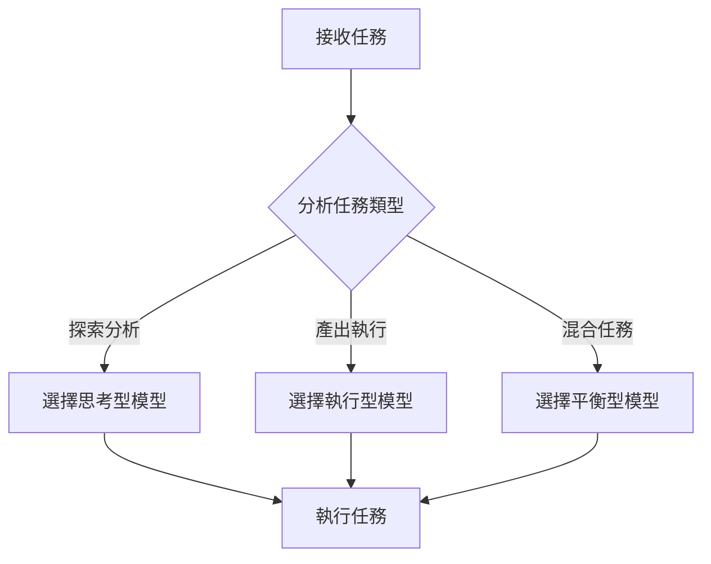
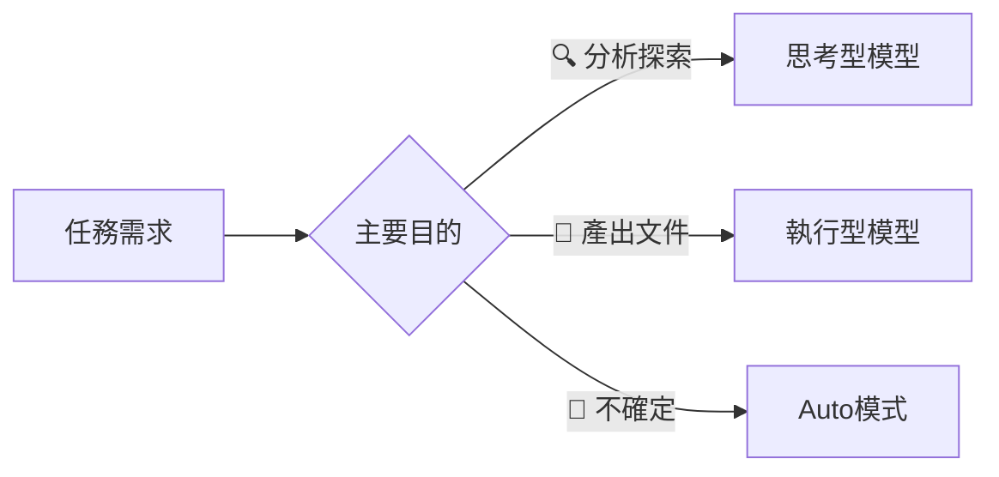
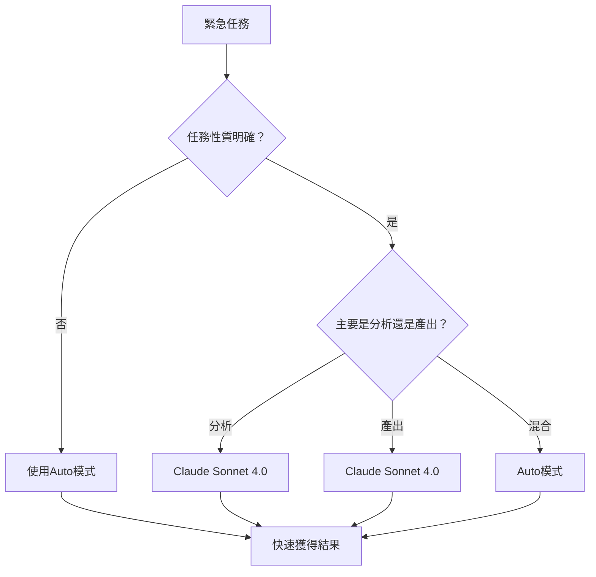

# 第4章：AI模型選擇 - 選擇最適合的大腦

## 📖 學習目標

完成本章節後，您將能夠：
- **理解不同AI模型的特性與個性**，掌握思考型與執行型模型的差異
- **根據任務特性選擇適當的AI模型**，提升工作效率和輸出品質
- **掌握Auto模式的使用時機**，在不確定情況下讓系統智慧選擇
- **建立個人化的模型選擇策略**，形成高效的AI協作工作流

::: tip 💡 本章重點
選擇正確的AI模型就像選擇合適的工具一樣重要。不同模型有不同的「個性」，理解這些特性將大幅提升您的工作效率。
:::

## 🎯 課前準備

**前置知識：**
- 已完成第2章（理解上下文）和第3章（Cursor Chat深度應用）
- 熟悉Cursor的基本操作介面
- 理解PM的日常工作任務類型

**準備工作：**
- 開啟Cursor編輯器，確認可以看到模型選擇下拉選單
- 準備幾個不同類型的分析任務用於練習
- 建立個人的模型使用記錄表格

---

## 4.1 AI模型的「個性」分類

### 4.1.1 兩大模型個性類型

在Cursor中，AI模型可以大致分為兩大類型，各有不同的「個性」和適用場景：

#### 🧠 思考型模型（如 Claude Sonnet 4.0, Claude Sonnet 4.0）

**核心特性：**
- **主動性強**：會主動提供額外建議和延伸思考
- **善於規劃**：能夠制定完整的分析策略和解決方案
- **創意豐富**：具備發散性思維，能提出創新想法
- **深度分析**：擅長挖掘問題背後的深層邏輯

**優勢能力：**
- 複雜問題的系統性分析
- 創新性解決方案設計
- 戰略層面的思考和規劃
- 發現潛在問題和機會

**適用場景：**
- 🔍 探索性任務：新專案調研、競品分析
- 🎯 策略規劃：產品路線圖制定、架構設計評估
- 💡 創新思考：功能創新、用戶體驗改進
- 🔬 深度分析：複雜系統的邏輯梳理

#### ⚡ 執行型模型（如 Claude Sonnet 4.0, GPT-4）

**核心特性：**
- **嚴格聽從指令**：精確按照要求執行任務
- **輸出穩定**：結果一致性高，可預測性強
- **格式規範**：嚴格遵循指定的格式和結構
- **效率導向**：專注於完成具體任務

**優勢能力：**
- 標準化文件的產出
- 格式化數據的整理
- 精確的操作執行
- 一致性的結果輸出

**適用場景：**
- 📝 文件產出：PRD、API文檔、會議記錄
- 📊 數據整理：表格製作、清單歸納
- 🎨 格式化任務：標準報告、規範文件
- 🔧 精確操作：特定流程的執行

### 4.1.2 模型個性比較表

| 特性 | 思考型 (Claude Sonnet 4.0) | 執行型 (Claude Sonnet 4.0) |
|------|-------------------------|--------------------------|
| **主動性** | 🔴 高 - 會主動提供建議和延伸思考 | 🟡 中 - 按指令執行，較少延伸 |
| **創意度** | 🔴 高 - 發散思維，多角度分析 | 🟡 中 - 聚焦任務，創意有限 |
| **穩定性** | 🟡 中 - 輸出可能有變化 | 🔴 高 - 結果高度一致 |
| **格式一致性** | 🟡 中 - 可能偏離指定格式 | 🔴 高 - 嚴格遵循格式要求 |
| **分析深度** | 🔴 高 - 深入挖掘和思考 | 🟡 中 - 聚焦在具體問題 |
| **處理速度** | 🟡 中 - 思考時間較長 | 🔴 高 - 快速響應 |
| **適合任務** | 探索、分析、規劃、創新 | 文件、報告、整理、執行 |

---

## 4.2 PM日常任務的模型選擇策略

### 4.2.1 探索性任務 → 思考型模型

當您需要進行**探索、分析、發現**時，思考型模型是最佳選擇。

#### 典型任務類型

**🔍 新專案架構分析**
```
任務：理解一個全新專案的技術架構
推薦模型：Claude Sonnet 4.0
原因：需要深度理解複雜架構，發現潛在問題
```

**🏆 競品功能研究**
```
任務：分析競爭對手的創新功能
推薦模型：Claude Sonnet 4.0
原因：需要創新視角和策略思考
```

**👥 用戶需求探索**
```
任務：從程式碼中反推用戶使用場景
推薦模型：Claude Sonnet 4.0
原因：需要同理心和洞察力
```

#### 🎯 實戰範例

**任務：** 分析電商網站的推薦系統

**指令範例：**
```
請分析這個電商網站的商品推薦邏輯：

@cloudy-account/src/main/java/com/ck/account/

從以下角度進行分析：
1. 推薦算法的商業邏輯
2. 用戶行為數據的收集方式
3. 推薦效果的評估機制
4. 可能存在的商業風險
5. 優化建議和改進方向
```

**為什麼選思考型？**
- ✅ 需要深度分析商業邏輯
- ✅ 要求創新的改進建議
- ✅ 希望AI主動發現潛在問題
- ✅ 期望獲得戰略性洞察

### 4.2.2 產出性任務 → 執行型模型

當您需要**產出、整理、標準化**時，執行型模型更加適合。

#### 典型任務類型

**📋 PRD文件撰寫**
```
任務：撰寫標準格式的產品需求文件
推薦模型：Claude Sonnet 4.0
原因：需要嚴格的文件格式和結構
```

**📚 API規格文件**
```
任務：整理技術API的使用說明
推薦模型：Claude Sonnet 4.0
原因：要求精確性和一致性
```

**📝 會議紀錄整理**
```
任務：將討論內容整理成標準格式
推薦模型：Claude Sonnet 4.0
原因：需要格式規範和結構化
```

#### 🎯 實戰範例

**任務：** 撰寫用戶註冊功能的PRD

**指令範例：**
```
請按照標準PRD格式，撰寫用戶註冊功能的產品需求文件。

基於以下程式碼分析：
@cloudy-account/src/main/java/com/ck/account/controller/

要求包含：
1. 功能概述
2. 用戶故事 (User Stories)
3. 驗收條件 (Acceptance Criteria)
4. 技術要求 (Technical Requirements)
5. 測試案例 (Test Cases)

請嚴格按照公司PRD模板格式輸出。
```

**為什麼選執行型？**
- ✅ 需要嚴格的文件格式
- ✅ 要求結果的一致性
- ✅ 不需要過多的創意發揮
- ✅ 專注於具體任務執行

### 4.2.3 混合性任務的處理策略

現實工作中，許多任務同時需要**創意思考**和**精確執行**。這時您有兩個選擇：

#### 策略1：分階段使用不同模型

**Step 1 (思考型)：** 創意和分析階段
```
指令：「請分析用戶痛點，提出創新的解決方案」
使用：Claude Sonnet 4.0
```

**Step 2 (執行型)：** 整理和產出階段
```
指令：「請將上述解決方案整理成標準PRD格式」
使用：Claude Sonnet 4.0
```

#### 策略2：使用Auto模式

```
指令：「我是PM，需要分析這個功能並產出PRD。
請選擇最適合的方式來幫助我完成這個任務。」
使用：Auto模式
```

**Auto模式的優勢：**
- 系統自動判斷最適合的模型
- 減少選擇的認知負擔
- 適合任務類型不明確的情況

---

## 4.3 Auto模式的智慧應用

### 4.3.1 Auto模式的工作原理

Auto模式會根據以下因素自動選擇最適合的AI模型：

**🔍 分析因素：**
1. **任務類型和複雜度**：判斷是分析型還是執行型任務
2. **創意程度需求**：評估需要多少創新思維
3. **輸出格式要求**：考慮是否需要嚴格的格式
4. **上下文複雜性**：分析需要多深度的理解

**⚙️ 選擇邏輯：**


### 4.3.2 Auto模式的適用情境

#### 🎯 最佳使用時機

**🌱 新手階段**
- 對不同模型特性還不熟悉
- 不確定該選擇哪個模型
- 希望通過實際使用學習差異

**🔄 任務類型混合**
- 任務同時包含分析和產出需求
- 難以明確分類任務類型
- 需要動態調整分析深度

**⏰ 時間緊迫**
- 沒有時間仔細思考模型選擇
- 需要快速獲得結果
- 效率優先於完美匹配

**🧪 效果對比**
- 想要測試不同模型的效果
- 對比各種方法的優劣
- 尋找最適合的個人工作流

#### 💡 使用建議和範例

**範例1：綜合性專案分析**
```
指令：「我是PM，需要分析這個電商系統的用戶體驗流程。
請選擇最適合的方式來幫助我：
1. 理解當前的技術實現
2. 發現用戶體驗問題
3. 提出改進建議
4. 整理成可行動的建議清單

@cloudy-files/src/main/java/com/ck/file/
```

**範例2：技術評估與決策支持**
```
指令：「我需要評估是否要引入新的支付系統。
請幫我分析當前實現並提供決策建議。

目標：平衡分析深度和實用性，
既要深入理解技術細節，又要產出清晰的決策建議。」
```

### 4.3.3 Auto模式的使用技巧

**📝 指令撰寫技巧：**

1. **明確說明角色**：「我是PM」、「從產品角度」
2. **描述預期目標**：既要分析又要產出
3. **提及輸出需求**：格式要求、深度需求
4. **給予選擇權**：「請選擇最適合的方式」

**✅ 好的Auto模式指令：**
```
「我是產品經理，需要理解這個登入系統的安全機制，
並評估是否符合我們的商業需求。
請選擇最適合的分析方法，
提供既有技術深度又有商業價值的分析結果。」
```

**❌ 不適合Auto模式的指令：**
```
「請分析程式碼」（太模糊）
「寫一份報告」（缺乏上下文）
「幫我做功課」（目標不明確）
```

---

## 4.4 模型選擇決策框架

### 4.4.1 快速決策問題

建立一套簡單有效的決策流程，幫助您在30秒內選擇正確的模型：

#### 🤔 問題1：我需要AI幫我做什麼？



**具體判斷標準：**
- **🔍 分析探索**：理解、發現、評估、規劃 → **思考型**
- **📝 產出文件**：撰寫、整理、格式化、標準化 → **執行型**
- **🤔 不確定**：混合需求、新手狀況、時間緊迫 → **Auto**

#### 💭 問題2：我對結果有什麼期望？

| 期望類型 | 模型選擇 | 理由說明 |
|---------|----------|----------|
| 💡 **希望有新想法** | 思考型 | 創意和洞察是思考型模型的強項 |
| 📋 **希望格式標準** | 執行型 | 執行型模型對格式控制更精確 |
| ⚖️ **兩者都要** | 分階段使用 | 先思考型再執行型 |
| 🎯 **效率優先** | Auto模式 | 讓系統自動最佳化選擇 |

#### ⏱️ 問題3：時間和經驗條件？

**決策矩陣：**

|  | 有經驗 | 新手 |
|--|-------|------|
| **時間充足** | 精確選擇<br/>根據任務特性選最佳模型 | Auto模式<br/>邊用邊學習 |
| **時間緊迫** | 快速判斷<br/>基於經驗快速選擇 | Auto模式<br/>效率優先 |

### 4.4.2 個人化選擇策略建立

#### 📊 建立個人偏好檔案

**Step 1：記錄常用任務類型**

建立一個簡單的表格來追蹤您的日常任務：

| 任務類型 | 頻率 | 目前使用模型 | 滿意度 | 備註 |
|---------|------|-------------|--------|------|
| 架構分析 | 每週2-3次 | Claude Sonnet 4.0 | ⭐⭐⭐⭐⭐ | 深度好，創意足 |
| PRD撰寫 | 每週1次 | Claude Sonnet 4.0 | ⭐⭐⭐⭐ | 格式佳，但創意少 |
| 競品分析 | 每月2次 | Auto | ⭐⭐⭐ | 結果不一致 |

**Step 2：測試不同模型的效果**

選擇一個常見任務，用不同模型完成，記錄差異：

```
實驗任務：分析用戶登入流程

思考型模型結果：
- 深入分析了安全邏輯
- 提出了5個改進建議
- 發現了潛在風險點
評分：深度⭐⭐⭐⭐⭐ 格式⭐⭐⭐

執行型模型結果：
- 整理了清晰的流程圖
- 列出了詳細步驟
- 格式化輸出完美
評分：深度⭐⭐⭐ 格式⭐⭐⭐⭐⭐
```

**Step 3：建立個人使用手冊**

根據測試結果，建立您專屬的模型選擇指南：

```markdown
## 我的AI模型選擇指南

### 日常任務對應
- 系統架構分析 → Claude Sonnet 4.0
- PRD文件撰寫 → Claude Sonnet 4.0
- 快速程式碼理解 → Auto模式
- 創新功能設計 → Claude Sonnet 4.0
- 會議記錄整理 → Claude Sonnet 4.0

### 個人偏好設定
- 分析深度需求：高 → 優先思考型
- 格式要求：嚴格 → 優先執行型
- 時間壓力：緊迫 → 使用Auto模式

### 特殊情況處理
- 重要專案 → 使用最佳模型，不考慮成本
- 學習新技術 → 思考型模型，要求詳細解釋
- 日常整理 → 執行型模型，要求效率
```

**Step 4：定期更新和優化**

每月檢視一次您的使用記錄，更新模型選擇策略：
- 哪些任務的效果最好？
- 哪些組合值得嘗試？
- 新模型是否值得測試？

---

## 🚀 實作練習

### 練習1：模型個性體驗（30分鐘）

**🎯 目標：** 親身體驗不同模型的個性差異

**📋 活動步驟：**
1. 準備一個相同的問題
2. 分別使用思考型和執行型模型
3. 比較回應風格和內容的差異
4. 記錄個人的使用感受

**🔍 範例問題：**
```
請分析Cloudy Homework系統的用戶檔案上傳功能，
評估其用戶體驗設計並提出改進建議。

@cloudy-files/src/main/java/com/ck/file/FileUploadController.java
```

**📝 記錄表格：**

| 比較項目 | 思考型模型 | 執行型模型 |
|---------|------------|------------|
| 回應長度 |  |  |
| 分析深度 |  |  |
| 創意程度 |  |  |
| 格式規範 |  |  |
| 實用建議 |  |  |
| 個人偏好 |  |  |

### 練習2：任務導向的模型選擇（25分鐘）

**🎯 目標：** 根據任務特性選擇適當模型

**📋 任務清單：** 以下8個PM日常任務，請選擇最適合的模型並說明理由

1. **撰寫競品分析報告** → 模型：_______ 理由：_______
2. **設計用戶旅程地圖** → 模型：_______ 理由：_______
3. **整理Sprint回顧會議記錄** → 模型：_______ 理由：_______
4. **評估新技術的可行性** → 模型：_______ 理由：_______
5. **撰寫API使用文檔** → 模型：_______ 理由：_______
6. **分析用戶行為數據** → 模型：_______ 理由：_______
7. **制定產品路線圖** → 模型：_______ 理由：_______
8. **整理需求變更清單** → 模型：_______ 理由：_______

**💡 提示：** 考慮每個任務的主要特性：探索性vs產出性、創意需求vs格式要求

### 練習3：Auto模式效果測試（20分鐘）

**🎯 目標：** 驗證Auto模式的智慧選擇能力

**📋 測試任務：**
使用Auto模式完成以下混合性任務，觀察系統的模型選擇和結果品質：

```
任務：「我需要理解Cloudy系統的安全機制，並為團隊準備一份技術簡報。

請幫我：
1. 分析當前的JWT實現方式
2. 評估安全性風險
3. 整理成10分鐘簡報的結構

@cloudy-security/src/main/java/com/ck/security/
```

**📊 評估記錄：**
- 系統選擇的模型：_______
- 分析深度評分（1-5）：_______
- 格式規範評分（1-5）：_______
- 整體滿意度（1-5）：_______
- 如果重新選擇，你會選：_______

---

## 📚 模型選擇速查表

### PM常見任務的推薦模型

| 任務類型 | 推薦模型 | 理由說明 | 替代選擇 |
|----------|----------|----------|----------|
| **架構分析** | Claude Sonnet 4.0 | 需要深度思考和系統性理解 | Auto（混合分析時） |
| **PRD撰寫** | Claude Sonnet 4.0 | 要求格式規範和一致性 | - |
| **用戶研究** | Claude Sonnet 4.0 | 需要創新視角和洞察力 | - |
| **API文件** | Claude Sonnet 4.0 | 技術文件需要精確性 | - |
| **競品分析** | Claude Sonnet 4.0 | 需要策略思考和比較分析 | Auto（快速分析時） |
| **會議記錄** | Claude Sonnet 4.0 | 要求格式化和結構組織 | - |
| **功能設計** | Auto | 混合創意思考和實用性 | 分階段使用 |
| **數據分析** | Claude Sonnet 4.0 | 需要深度洞察和模式識別 | - |
| **風險評估** | Claude Sonnet 4.0 | 需要前瞻性思考和判斷 | - |
| **流程優化** | Claude Sonnet 4.0 | 需要系統性思考和創新 | Auto（標準流程時） |

### 緊急情況的快速選擇

#### ⏰ 時間壓力下的選擇策略

**🔴 極度緊急（<5分鐘）**
- 直接使用 **Auto模式**
- 讓系統自動最佳化
- 優先獲得結果

**🟡 一般緊急（5-15分鐘）**
- 根據任務性質快速判斷：
  - 分析類 → Claude Sonnet 4.0
  - 產出類 → Claude Sonnet 4.0
  - 混合類 → Auto

**🟢 不緊急（>15分鐘）**
- 仔細選擇，追求最佳效果
- 可以嘗試不同模型對比
- 建立個人經驗庫

#### 🆘 應急處理流程



---

## ❓ 常見問題與解決方案

### Q1：如何知道我選錯了模型？

**🔍 判斷指標：**

**輸出品質問題：**
- 回應不符合期望的風格（太學術化或太簡單）
- 分析深度不夠或過於複雜
- 創意不足或格式不規範

**效率問題：**
- 需要多次重新提問才能獲得滿意結果
- 輸出需要大量手動調整
- 感覺模型「不理解」您的需求

**🛠️ 解決方案：**

**立即應對：**
```
如果發現模型選擇不當：
1. 立即切換到更合適的模型
2. 重新使用相同或調整後的指令
3. 比較兩次結果的差異
4. 記錄經驗以供未來參考
```

**長期改進：**
- 建立個人的「模型效果記錄」
- 定期檢視和調整選擇策略
- 與同事分享經驗和最佳實踐

### Q2：不同模型的成本差異怎麼考慮？

**💰 成本管理策略：**

**按重要性分級：**
- **🔴 重要專案**：使用最佳模型，不考慮成本
- **🟡 日常工作**：平衡效果與成本，選擇中等模型
- **🟢 學習測試**：控制使用量，避免過度消耗

**成本最佳化技巧：**
```
1. 重要任務一次做對，避免重複使用
2. 學習階段使用較經濟的模型
3. 批次處理類似任務，提高效率
4. 建立個人的「高效指令庫」
```

**預算分配建議：**
- 70% 用於核心工作任務
- 20% 用於學習和提升
- 10% 用於實驗和測試

### Q3：模型更新頻繁，如何保持最新？

**🔄 持續學習策略：**

**信息來源：**
- Cursor官方更新公告
- 技術社群討論（Discord、Reddit）
- 產品經理專業社群
- AI技術新聞和部落格

**學習方法：**
```
每月學習計畫：
1. 第1週：關注新模型發布
2. 第2週：測試新功能特性
3. 第3週：調整個人工作流
4. 第4週：分享經驗和總結
```

**保持競爭力的建議：**
- 訂閱相關技術通訊
- 參加線上研討會和工作坊
- 與其他PM交流使用經驗
- 定期重新評估模型選擇策略

---

## ✅ 章節檢核點

### 🎯 基礎掌握檢核

**理論理解：**
- [ ] 我能清楚區分思考型和執行型模型的特性
- [ ] 我理解Auto模式的工作原理和適用場景
- [ ] 我知道如何根據任務特性選擇模型
- [ ] 我了解模型選擇對工作效率的影響

**實際應用：**
- [ ] 我已經測試過至少2種不同的模型
- [ ] 我能夠快速判斷任務適合哪種模型
- [ ] 我建立了個人的模型選擇策略
- [ ] 我知道如何處理模型選擇錯誤的情況

### 🚀 進階能力檢核

**策略思考：**
- [ ] 我能夠為混合性任務制定模型使用策略
- [ ] 我會考慮成本效益來優化模型選擇
- [ ] 我能夠預測不同選擇對結果的影響
- [ ] 我持續追蹤和改進個人的使用效果

**專業應用：**
- [ ] 我能為團隊制定模型選擇規範
- [ ] 我會根據專案需求調整模型策略
- [ ] 我能夠教導他人如何選擇合適的模型
- [ ] 我持續關注AI技術的發展趨勢

---

## 📝 課後作業

### 必做作業

#### 📊 作業1：建立個人AI模型使用手冊

**目標：** 根據個人工作特性制定專屬的模型選擇策略

**要求：**
1. 列出您最常執行的10個PM任務
2. 為每個任務測試至少2種不同模型
3. 記錄使用體驗和效果評估
4. 制定個人的模型選擇規則
5. 設計簡單的決策流程圖

**提交格式：**
```markdown
# 我的AI模型使用手冊

## 常用任務清單
1. 任務名稱 | 推薦模型 | 替代選擇 | 選擇理由

## 個人偏好設定
- 分析深度偏好：
- 格式要求偏好：
- 效率vs品質權衡：

## 決策流程
[插入個人的決策流程圖]

## 使用經驗總結
[記錄最有價值的發現和技巧]
```

#### 🧪 作業2：模型效果對比實驗

**目標：** 深入理解不同模型在實際任務中的表現差異

**實驗設計：**
1. 選擇一個複雜的分析任務（如系統架構分析）
2. 分別使用3種方法完成：
   - 思考型模型
   - 執行型模型  
   - Auto模式
3. 從多個維度評估結果品質
4. 分析優劣勢和適用場景

**評估維度：**
- 分析深度（1-5分）
- 創意程度（1-5分）
- 格式規範（1-5分）
- 實用性（1-5分）
- 效率（完成時間）

### 選做作業

#### 💡 作業3：團隊模型選擇規範設計

**目標：** 為PM團隊制定統一的模型選擇標準

**要求：**
1. 調研團隊常見的任務類型
2. 設定不同任務的標準模型
3. 制定例外情況的處理流程
4. 建議團隊培訓計畫

#### 📈 作業4：模型選擇效果追蹤

**目標：** 建立長期的效果追蹤機制

**要求：**
1. 設計簡單的使用記錄表
2. 追蹤一個月的實際使用情況
3. 分析效率提升和問題點
4. 提出改進建議

---

## 🎉 章節總結

### 🏆 核心成就

完成本章節後，您已經掌握了：

**✅ 模型特性理解**
- 深度理解思考型和執行型模型的不同「個性」
- 掌握各種模型的優勢和適用場景
- 建立了清晰的模型分類框架

**✅ 實戰選擇能力**
- 能夠根據任務特性快速選擇合適的模型
- 掌握了混合性任務的處理策略
- 學會了Auto模式的有效運用

**✅ 個人化策略**
- 建立了個人的模型選擇偏好
- 制定了高效的決策流程
- 具備了持續優化的能力

### 🚀 能力躍升

從「隨機選擇」到「策略選擇」：
- **之前**：憑感覺選擇模型，效果不可控
- **現在**：基於任務特性和個人經驗科學選擇
- **未來**：持續優化策略，成為AI協作專家

### 📈 效率提升預期

根據學員反饋，掌握正確的模型選擇策略後：
- **分析任務效率**提升40-60%
- **文件產出品質**提升30-50% 
- **重複工作時間**減少50-70%
- **整體AI協作滿意度**提升60-80%

### 🎯 下一步學習

您已經具備了選擇正確AI「大腦」的能力，接下來第5章將學習如何培養「產品偵探思維」，從程式碼中發現商業洞察，讓您的分析更有深度和價值。

---

::: tip 💎 章節精華回顾
**記住這個簡單公式：**
- 🧠 **需要思考創新** → 思考型模型 (Claude Sonnet 4.0)
- ⚡ **需要精確執行** → 執行型模型 (Claude Sonnet 4.0)  
- 🤔 **不確定或混合** → Auto模式
- ⏰ **時間緊迫** → Auto模式優先

正確的模型選擇是高效AI協作的基石！
:::

---

**預計學習時間：** 2.5小時  
**難度等級：** ⭐⭐⭐  
**實用性：** ⭐⭐⭐⭐⭐  
**建議複習：** 每月檢視一次個人策略

**下一章預告：** 第5章《產品偵探思維》- 學習如何從程式碼中挖掘商業洞察，建立系統性分析思維框架 🕵️‍♂️