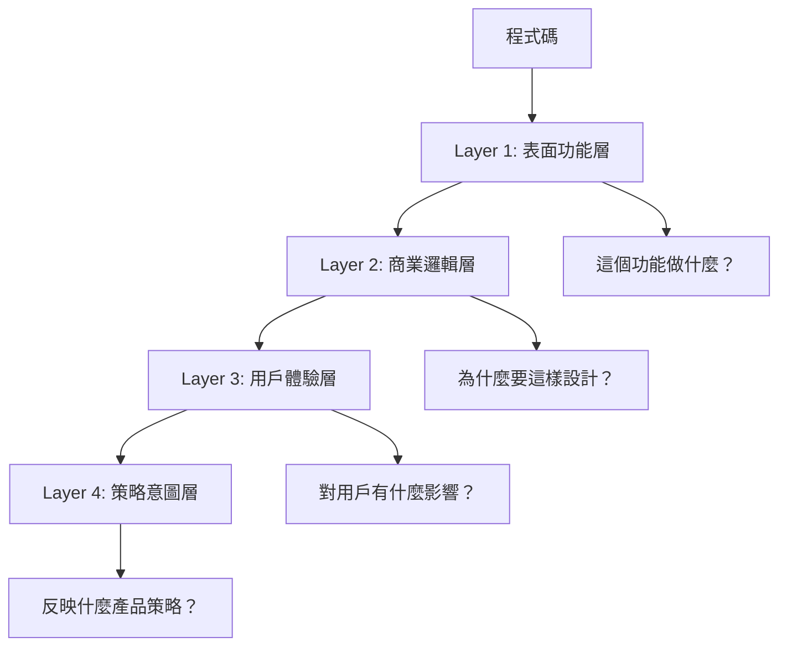

# 第5章：產品偵探思維 - 從工程師視角到商業洞察

## 📖 學習目標

完成本章節後，您將能夠：
- **建立產品偵探思維**，以商業邏輯為導向分析程式碼
- **重新定位Cursor的角色**，從程式開發工具轉為商業分析工具
- **掌握四層分析框架**，系統性地從程式碼中挖掘商業洞察
- **培養五大關鍵技能**，成為真正的產品偵探

::: tip 💡 本章重點
這是一個思維轉換的關鍵章節。我們要從「技術如何實現」轉向「為什麼這樣設計」，從程式碼中發現商業價值和產品策略。
:::

## 🎯 課前準備

**前置知識：**
- 已完成第3章（Cursor Chat深度應用）和第4章（AI模型選擇）
- 熟悉基本的程式碼分析操作
- 理解PM與開發者的角色差異

**準備工作：**
- 開啟Cloudy Homework專案作為實戰載體
- 準備筆記本記錄思維轉換的心得
- 設定「產品偵探」的心態和角色定位

---

## 5.1 思維轉換的必要性

### 5.1.1 為什麼需要思維轉換？

身為產品經理，我們面對程式碼時經常陷入一個陷阱：**被技術細節吸引，忽略了商業本質**。

**常見的思維陷阱：**
```
❌ 錯誤思維：「這個API怎麼寫的？」
✅ 正確思維：「這個API為什麼要這樣設計？」

❌ 錯誤思維：「這個演算法複雜度如何？」
✅ 正確思維：「這個演算法解決了什麼商業問題？」

❌ 錯誤思維：「程式碼品質好不好？」
✅ 正確思維：「這個設計對用戶體驗有什麼影響？」
```

### 5.1.2 工程師思維 vs 產品偵探思維

讓我們來看看這兩種思維方式的根本差異：

#### 🔧 工程師思維特徵

**關注焦點：**
- 程式碼的技術實現細節
- 演算法效率和程式碼品質
- 如何寫出更好的程式碼
- 解決技術問題和bug

**典型問題：**
- "這個function是怎麼實現的？"
- "這裡有沒有性能問題？"
- "代碼風格是否符合規範？"
- "有什麼技術債務需要處理？"

**價值判斷標準：**
- 程式碼是否優雅
- 架構是否合理
- 性能是否最佳
- 技術是否先進

#### 🕵️ 產品偵探思維特徵

**關注焦點：**
- 程式碼背後的商業邏輯
- 功能設計的商業意義
- 對用戶價值的影響
- 產品策略的體現

**典型問題：**
- "為什麼要這樣設計這個功能？"
- "這個決策背後的商業考量是什麼？"
- "對用戶體驗有什麼影響？"
- "這反映了什麼產品策略？"

**價值判斷標準：**
- 是否符合商業目標
- 是否提升用戶價值
- 是否支持產品策略
- 是否創造競爭優勢

### 5.1.3 思維轉換對比表

| 面向 | 工程師思維 | 產品偵探思維 |
|------|------------|--------------|
| **關注點** | 程式碼如何運作 | 為什麼要這樣設計 |
| **問題導向** | "這個bug怎麼修？" | "這個問題影響多少用戶？" |
| **價值判斷** | 程式碼是否優雅 | 功能是否符合商業目標 |
| **決策依據** | 技術最佳實踐 | 用戶需求和商業價值 |
| **成功指標** | 程式碼品質 | 產品成功指標 |
| **分析深度** | 技術實現層面 | 商業策略層面 |
| **輸出結果** | 技術建議 | 產品決策依據 |

### 5.1.4 真實案例對比

讓我們用一個具體例子來說明差異：

**分析對象：** 用戶登入功能的Token過期機制

#### 🔧 工程師思維分析：
```
技術發現：
- JWT Token設定為24小時過期
- 使用HMAC SHA256加密演算法
- 沒有實現Refresh Token機制
- Token存儲在LocalStorage中

技術建議：
- 實現Refresh Token提升安全性
- 考慮使用更短的過期時間
- 改用HttpOnly Cookie存儲
```

#### 🕵️ 產品偵探思維分析：
```
商業洞察：
- 24小時過期平衡了安全性與用戶體驗
- 簡單的Token機制降低了開發複雜度
- 沒有自動刷新機制可能影響用戶體驗
- 這個設計反映了「簡單優先」的產品策略

商業建議：
- 評估用戶登入頻率，決定是否需要優化
- 考慮用戶反饋中關於重複登入的抱怨
- 分析競品的處理方式
- 制定安全性與易用性的平衡策略
```

**關鍵差異：** 工程師關注技術實現，產品偵探關注商業影響。

---

## 5.2 重新定位Cursor的角色

### 5.2.1 從程式開發工具到商業分析工具

傳統上，我們可能把Cursor視為「程式開發工具」，但對產品經理而言，Cursor應該被重新定位為**「商業分析工具」**。

#### 🔄 角色轉換對照

| 傳統角色 | 新角色定位 | 核心價值 |
|----------|------------|----------|
| 程式編輯器 | 商業邏輯分析師 | 理解業務規則 |
| 程式碼檢查工具 | 產品策略解讀器 | 發現設計意圖 |
| 技術助手 | 商業顧問 | 提供決策支持 |

### 5.2.2 Cursor的三大新角色定位

#### 🌐 角色1：技術翻譯

**功能定義：** 將複雜的程式碼邏輯轉化為清晰的商業語言

**價值主張：** 幫助PM理解技術實現，無需深入程式設計細節

**應用場景：**
- 向非技術團隊解釋功能實現原理
- 與開發團隊進行技術溝通
- 評估技術方案的商業可行性

**實戰範例：**
```
PM需求：「支付流程為什麼這麼複雜？」

Cursor技術翻譯：
「支付流程包含5個關鍵步驟：
1. 訂單確認 - 確保商品庫存可用
2. 支付驗證 - 檢查用戶資金狀況
3. 庫存鎖定 - 預留商品防止超賣
4. 交易處理 - 實際完成金流扣款
5. 結果通知 - 同步更新各系統狀態

複雜性主要來自於保證交易安全和數據一致性，
這是金融級應用的必要設計。」
```

#### 🏗️ 角色2：隨身架構師

**功能定義：** 提供系統架構的全貌視角和專業解讀

**價值主張：** 快速掌握複雜系統的整體結構和關係

**應用場景：**
- 新專案接手時的快速理解
- 架構評估和技術決策支持
- 系統擴展和重構的可行性分析

**實戰範例：**
```
指令：「請分析Cloudy系統的整體架構設計」

架構師視角解答：
「Cloudy採用了微服務架構模式：

核心服務：
- cloudy-account：用戶管理中心，負責身份認證
- cloudy-files：檔案處理服務，支援檔案上傳下載
- cloudy-security：安全服務，提供JWT認證機制
- cloudy-event：事件處理，基於Google Cloud Functions

架構優勢：
- 服務獨立部署，支援彈性擴展
- 責任分離清晰，便於團隊分工
- 雲原生設計，降低運維成本

潛在挑戰：
- 服務間通訊複雜度
- 資料一致性管理
- 分散式系統的除錯難度」
```

#### ✅ 角色3：邏輯驗證器

**功能定義：** 檢驗商業需求與技術實現的一致性

**價值主張：** 發現需求和實現之間的差距或矛盾

**應用場景：**
- 需求驗證和確認
- 功能測試前的邏輯檢查
- 產品發佈前的風險識別

**實戰範例：**
```
商業需求：「用戶可以刪除自己上傳的任何檔案」

邏輯驗證結果：
「技術實現與需求存在差異：

目前實現：
- 只能刪除「未被分享」的檔案
- 已分享檔案需要先取消分享才能刪除
- 有時間限制：上傳24小時後無法刪除

商業影響：
- 可能造成用戶困惑和抱怨
- 需要清楚的UI提示和說明
- 考慮是否符合用戶預期

建議：
- 釐清產品策略：安全優先還是易用性優先？
- 設計清晰的用戶提示機制
- 考慮提供管理員協助刪除的流程」
```

---

## 5.3 商業洞察挖掘方法論

### 5.3.1 四層分析框架

產品偵探思維的核心是**逐層深入的分析方法**。我們要像剝洋蔥一樣，一層層挖掘程式碼背後的商業邏輯。

#### 📊 框架總覽



#### 🔍 Layer 1: 表面功能層

**核心問題：** 這個功能做什麼？

**分析重點：** 基本功能和操作流程

**提問技巧：**
```
標準提問模板：
「請描述這個功能的基本用途和主要操作流程」

深入提問：
- 這個模組負責什麼業務功能？
- 主要的輸入和輸出是什麼？
- 涉及哪些關鍵步驟？
```

**產出目標：** 功能清單和基本操作流程

#### 🧠 Layer 2: 商業邏輯層

**核心問題：** 為什麼要這樣設計？

**分析重點：** 設計決策背後的商業考量

**提問技巧：**
```
標準提問模板：
「這個設計決策背後的商業考量是什麼？」

深入提問：
- 為什麼選擇這種實現方式？
- 這樣設計要解決什麼商業問題？
- 有哪些商業規則體現在程式碼中？
```

**產出目標：** 商業規則和決策邏輯

#### 👥 Layer 3: 用戶體驗層

**核心問題：** 對用戶有什麼影響？

**分析重點：** 技術實現對用戶體驗的影響

**提問技巧：**
```
標準提問模板：
「這個實現方式如何影響用戶體驗？」

深入提問：
- 用戶會有什麼感受？
- 可能遇到什麼困難？
- 與競品相比有什麼優劣勢？
```

**產出目標：** 用戶旅程和痛點分析

#### 🎯 Layer 4: 策略意圖層

**核心問題：** 這反映了什麼產品策略？

**分析重點：** 背後的產品策略和商業意圖

**提問技巧：**
```
標準提問模板：
「這個功能如何支持整體產品目標？」

深入提問：
- 體現了什麼產品理念？
- 支持什麼商業目標？
- 反映了什麼競爭策略？
```

**產出目標：** 策略洞察和競爭分析

### 5.3.2 實戰案例：四層分析購物車功能

讓我們用Cloudy系統中的檔案管理功能來示範四層分析：

#### 🔍 Layer 1 分析：表面功能層

**分析指令：**
```
請分析Cloudy系統的檔案上傳功能，描述其基本功能和操作流程。

@cloudy-files/src/main/java/com/ck/file/controller/FilePorcessController.java
```

**典型發現：**
```
基本功能：
- 支援多檔案同時上傳
- 檔案大小限制為10MB
- 支援常見格式：PDF、DOC、IMG
- 提供上傳進度顯示
- 自動生成唯一檔案ID

操作流程：
1. 用戶選擇檔案
2. 系統驗證檔案格式和大小
3. 建立上傳任務
4. 分片上傳到雲端儲存
5. 更新資料庫記錄
6. 返回上傳結果
```

#### 🧠 Layer 2 分析：商業邏輯層

**分析指令：**
```
檔案上傳為什麼要設定10MB的大小限制？
這個商業邏輯的目的是什麼？請從成本、性能、用戶體驗等角度分析。
```

**典型發現：**
```
商業邏輯分析：

成本考量：
- 10MB限制控制儲存成本
- 減少頻寬使用費用
- 降低伺服器處理負擔

性能考量：
- 確保上傳速度體驗
- 避免系統過載
- 保證其他用戶正常使用

商業策略：
- 平衡功能豐富度與成本
- 引導用戶使用雲端儲存付費服務
- 區分免費用戶與付費用戶權限
```

#### 👥 Layer 3 分析：用戶體驗層

**分析指令：**
```
檔案大小限制和分片上傳機制如何影響用戶體驗？
分析用戶可能遇到的問題和感受。
```

**典型發現：**
```
用戶體驗影響：

正面影響：
- 上傳速度較快，即時反饋好
- 進度條提供良好的心理預期
- 錯誤處理清晰，用戶知道如何解決

負面影響：
- 10MB限制可能不夠用，特別是設計檔案
- 需要壓縮或分割大檔案，增加操作複雜度
- 與競品相比限制較嚴格

用戶痛點：
- 大檔案處理困難
- 批量上傳時頻繁遇到限制
- 不清楚為什麼有這個限制
```

#### 🎯 Layer 4 分析：策略意圖層

**分析指令：**
```
這個檔案上傳設計反映了什麼樣的產品策略？
分析其商業定位和競爭考量。
```

**典型發現：**
```
策略意圖分析：

產品定位：
- 面向輕量級檔案分享需求
- 重視成本效益而非功能極致
- 適合中小型團隊和個人用戶

商業策略：
- 免費增值模式：基礎功能免費，高級功能付費
- 成本優先：控制營運成本，保證服務穩定
- 差異化競爭：專注於簡單易用，而非功能豐富

競爭考量：
- 與Google Drive、Dropbox等巨頭錯位競爭
- 避免高成本的全功能競爭
- 專注於特定用戶群體的深度需求
```

### 5.3.3 四層分析的實戰技巧

#### 💡 提問技巧進階

**Layer 1 的有效提問：**
```
✅ 好的提問：
「這個模組的核心功能是什麼？主要處理什麼業務流程？」

❌ 避免的提問：
「這段程式碼是什麼意思？」（過於技術化）
```

**Layer 2 的有效提問：**
```
✅ 好的提問：
「為什麼要這樣設計權限控制？背後的商業邏輯是什麼？」

❌ 避免的提問：
「程式碼寫得好不好？」（偏離商業焦點）
```

**Layer 3 的有效提問：**
```
✅ 好的提問：
「這個實現方式對用戶的日常操作有什麼影響？」

❌ 避免的提問：
「介面設計是否美觀？」（不是程式碼分析重點）
```

**Layer 4 的有效提問：**
```
✅ 好的提問：
「這個功能設計如何支持公司的商業目標？」

❌ 避免的提問：
「技術架構是否先進？」（偏離策略思考）
```

#### 🎯 分析深度控制

**時間分配建議：**
- Layer 1（20%）：快速了解基本功能
- Layer 2（40%）：重點挖掘商業邏輯
- Layer 3（25%）：分析用戶體驗影響
- Layer 4（15%）：提煉策略洞察

**深度控制原則：**
- 重要功能：四層全做，每層深入
- 一般功能：重點做Layer 2、3
- 輔助功能：Layer 1、2 即可

---

## 5.4 產品偵探的核心技能

### 5.4.1 五大關鍵技能

#### 🔍 技能1：好奇心驅動的提問

**技能定義：** 不滿足於表面答案，持續深挖背後原因

**培養方法：**
```
練習框架：
1. 聽到答案後，問「為什麼？」
2. 得到解釋後，問「還有其他原因嗎？」
3. 理解邏輯後，問「這樣做的後果是什麼？」
4. 掌握影響後，問「有沒有更好的方式？」
```

**實戰範例：**
```
第一層提問：「這個登入功能是怎麼實現的？」
↓
第二層提問：「為什麼選擇JWT而不是Session？」
↓
第三層提問：「JWT的無狀態特性對我們的商業目標有什麼幫助？」
↓
第四層提問：「這個選擇在用戶規模擴大時會有什麼影響？」
```

#### 💰 技能2：商業價值判斷

**技能定義：** 評估功能的商業意義，識別價值創造點

**判斷框架：**
```
商業價值評估矩陣：

影響範圍 x 價值程度
- 高影響 x 高價值 = 核心競爭力
- 高影響 x 低價值 = 改進機會
- 低影響 x 高價值 = 差異化功能
- 低影響 x 低價值 = 考慮移除
```

**實戰應用：**
```
功能：自動檔案備份

商業價值分析：
✅ 用戶價值：減少資料遺失風險，提升安全感
✅ 商業價值：增加用戶黏性，降低客服成本
✅ 成本考量：需要額外儲存空間，增加營運成本
✅ 競爭優勢：基礎功能，不構成差異化

結論：重要的用戶價值功能，但需要控制成本
```

#### 👥 技能3：用戶同理心

**技能定義：** 站在用戶角度思考，關注用戶體驗影響

**同理心培養：**
```
用戶視角練習：
1. 想像自己是目標用戶
2. 考慮使用情境和動機
3. 體驗實際操作流程
4. 識別痛點和困惑
5. 思考期望和需求
```

**思考框架：**
```
用戶體驗分析模板：

情境：用戶在什麼情況下使用這個功能？
動機：用戶希望達成什麼目標？
操作：實際的操作步驟是什麼？
感受：用戶在過程中的心理感受？
結果：用戶是否達成了預期目標？
```

#### 🔗 技能4：系統性思考

**技能定義：** 理解功能間的關聯，考慮整體架構影響

**系統思考框架：**
```
關聯性分析：
- 上游關聯：這個功能依賴什麼？
- 下游影響：這個功能影響什麼？
- 橫向關係：與其他功能如何互動？
- 整體影響：對系統整體有什麼影響？
```

**實戰範例：**
```
分析對象：用戶權限管理功能

系統性思考：
上游依賴：
- 依賴用戶認證系統
- 需要角色定義和權限配置

下游影響：
- 影響所有功能的存取控制
- 決定UI界面的顯示內容

橫向關係：
- 與檔案分享功能緊密相關
- 影響審計日誌的記錄

整體影響：
- 是系統安全的核心基礎
- 影響用戶體驗的流暢度
```

#### 💡 技能5：商業洞察提煉

**技能定義：** 從技術細節中提煉商業價值，轉化為可行動的產品建議

**提煉方法：**
```
洞察提煉流程：
1. 收集技術事實
2. 分析商業邏輯
3. 評估用戶影響
4. 識別戰略意圖
5. 提出行動建議
```

**產出模板：**
```
商業洞察報告模板：

【核心發現】
- 關鍵的商業邏輯或策略發現

【用戶影響】
- 對用戶體驗的正面和負面影響

【商業價值】
- 創造的商業價值或成本

【行動建議】
- 具體可執行的改進建議

【風險評估】
- 潛在風險和應對策略
```

### 5.4.2 技能綜合應用：完整分析範例

讓我們通過一個完整案例來展示五大技能的綜合應用：

**分析對象：** Cloudy系統的檔案分享功能

#### 🔍 應用技能1：好奇心驅動的提問

```
層次1：「檔案分享功能是如何實現的？」
發現：透過產生分享連結，設定存取權限

層次2：「為什麼要用分享連結而不是直接加用戶？」
發現：降低用戶管理複雜度，支援匿名分享

層次3：「匿名分享的商業考量是什麼？」
發現：提升分享便利性，增加病毒式傳播機會

層次4：「這種設計對用戶增長有什麼影響？」
發現：便利的分享可能帶來更多新用戶註冊
```

#### 💰 應用技能2：商業價值判斷

```
價值分析：
用戶價值：★★★★★ 分享是核心需求
商業價值：★★★★☆ 增加用戶黏性和傳播
開發成本：★★★☆☆ 中等複雜度
維護成本：★★☆☆☆ 相對簡單

結論：高價值功能，值得投資優化
```

#### 👥 應用技能3：用戶同理心

```
用戶情境分析：
場景：工作中需要快速分享檔案給外部合作夥伴
期望：簡單、快速、安全地分享檔案
痛點：
- 對方可能沒有帳號
- 不想透露對方的個人資訊
- 需要控制存取時間和權限

體驗評估：
目前實現基本滿足需求，但缺乏進階控制功能
```

#### 🔗 技能4：系統性思考

```
系統影響分析：
關聯功能：
- 檔案上傳（提供分享內容）
- 權限管理（控制存取權限）
- 用戶管理（追蹤分享行為）

潛在影響：
- 分享行為可能影響儲存空間使用
- 匿名存取可能帶來安全風險
- 分享統計可以提供用戶行為洞察
```

#### 💡 應用技能5：商業洞察提煉

```
【核心發現】
分享功能採用「簡單優先」策略，優先易用性而非功能豐富度

【用戶影響】
- 正面：降低分享門檻，提升使用便利性
- 負面：缺乏進階控制，可能不滿足企業用戶需求

【商業價值】
- 促進用戶增長和病毒式傳播
- 增加用戶黏性和使用頻率
- 為未來付費功能奠定基礎

【行動建議】
1. 增加分享密碼功能，提升安全性
2. 提供分享統計，幫助用戶了解影響力
3. 考慮企業版的進階分享控制功能

【風險評估】
- 安全風險：需要加強匿名存取的安全控制
- 濫用風險：需要監控異常分享行為
```

---

## 🚀 實作練習

### 練習1：思維轉換對比實驗（25分鐘）

**🎯 目標：** 體驗兩種思維方式的差異，培養產品偵探思維

**📋 活動步驟：**

**第一階段：工程師思維分析（10分鐘）**
1. 選擇Cloudy系統中的用戶認證功能
2. 從技術角度分析其實現方式
3. 關注技術細節和程式碼品質

**分析指令（工程師思維）：**
```
請從技術角度分析Cloudy系統的用戶認證實現：

@cloudy-security/src/main/java/com/ck/security/

重點關注：
- 使用了什麼技術棧？
- 程式碼品質如何？
- 有什麼技術優勢或問題？
- 性能表現如何？
```

**第二階段：產品偵探思維分析（15分鐘）**
1. 用同樣的功能進行分析
2. 從商業角度思考設計決策
3. 關注用戶價值和商業邏輯

**分析指令（產品偵探思維）：**
```
請從產品經理的角度分析Cloudy系統的用戶認證設計：

@cloudy-security/src/main/java/com/ck/security/

重點關注：
- 為什麼選擇這種認證方式？
- 體現了什麼產品策略？
- 對用戶體驗有什麼影響？
- 支持什麼樣的商業目標？
```

**📊 對比記錄表：**

| 比較維度 | 工程師思維結果 | 產品偵探思維結果 |
|---------|---------------|-----------------|
| 關注重點 |  |  |
| 分析深度 |  |  |
| 提出問題 |  |  |
| 得出結論 |  |  |
| 實用價值 |  |  |

### 練習2：四層分析實戰（35分鐘）

**🎯 目標：** 熟練掌握四層分析框架，進行系統性商業洞察

**📋 分析對象：** Cloudy系統的檔案上傳功能

**Layer 1 分析（8分鐘）- 表面功能層**
```
指令：
「請描述Cloudy檔案上傳功能的基本用途和主要操作流程」

@cloudy-files/src/main/java/com/ck/file/controller/
```

**記錄模板：**
- 核心功能：
- 支援格式：
- 主要限制：
- 操作流程：

**Layer 2 分析（12分鐘）- 商業邏輯層**
```
指令：
「分析檔案上傳功能的設計決策背後的商業考量，
包括檔案大小限制、格式限制等規則的商業邏輯」
```

**記錄模板：**
- 設計考量：
- 成本因素：
- 風險控制：
- 商業規則：

**Layer 3 分析（10分鐘）- 用戶體驗層**
```
指令：
「從用戶體驗角度分析檔案上傳功能，
評估對用戶日常使用的影響和可能遇到的問題」
```

**記錄模板：**
- 正面體驗：
- 負面體驗：
- 用戶痛點：
- 期望落差：

**Layer 4 分析（5分鐘）- 策略意圖層**
```
指令：
「這個檔案上傳功能的設計反映了什麼樣的產品策略？
體現了怎樣的商業定位和競爭考量？」
```

**記錄模板：**
- 產品定位：
- 競爭策略：
- 商業模式：
- 未來規劃：

### 練習3：商業洞察提煉挑戰（20分鐘）

**🎯 目標：** 從技術實現中發現商業機會，提出具體的產品改進建議

**📋 挑戰任務：** 分析以下程式碼片段，提煉商業洞察

**分析對象：** 檔案存取權限控制機制

**挑戰指令：**
```
請分析Cloudy系統的檔案存取權限控制實現，
從中發現商業價值點並提出具體的產品改進建議：

@cloudy-files/src/main/java/com/ck/file/aop/LoginVeriftyAspect.java

要求：
1. 識別當前設計的商業邏輯
2. 發現潛在的商業機會
3. 提出3個具體改進建議
4. 評估每個建議的商業價值
```

**📊 洞察提煉模板：**

```markdown
## 商業洞察報告

### 核心發現
[描述最重要的商業邏輯發現]

### 商業機會識別
1. **機會1名稱**
   - 現況：
   - 機會：
   - 潛在價值：

2. **機會2名稱**
   - 現況：
   - 機會：
   - 潛在價值：

3. **機會3名稱**
   - 現況：
   - 機會：
   - 潛在價值：

### 改進建議
1. **建議1**
   - 內容：
   - 商業價值：
   - 實施難度：
   - 優先級：

2. **建議2**
   - 內容：
   - 商業價值：
   - 實施難度：
   - 優先級：

3. **建議3**
   - 內容：
   - 商業價值：
   - 實施難度：
   - 優先級：

### 總結
[整體洞察和建議優先級]
```

---

## 📋 產品偵探思維檢核表

### 🔄 思維轉換檢核

**基礎思維檢核：**
- [ ] 我關注的是商業邏輯而非技術細節
- [ ] 我思考的是用戶價值而非程式碼品質
- [ ] 我尋找的是商業洞察而非技術解決方案
- [ ] 我評估的是產品影響而非技術風險

**進階思維檢核：**
- [ ] 我能主動從多個角度思考問題
- [ ] 我會考慮功能間的系統性關聯
- [ ] 我能將技術發現轉化為商業建議
- [ ] 我保持對商業價值的敏感度

### 🎯 角色定位檢核

**Cursor使用檢核：**
- [ ] 我把Cursor當作技術翻譯使用
- [ ] 我利用Cursor進行架構分析
- [ ] 我運用Cursor驗證商業邏輯
- [ ] 我信任Cursor的專業建議

**角色轉換檢核：**
- [ ] 我不再把自己當成程式檢查員
- [ ] 我專注於商業價值發現
- [ ] 我用產品經理的語言思考
- [ ] 我關注用戶和市場需求

### 📊 分析深度檢核

**四層分析檢核：**
- [ ] 我進行了多層次的深入分析
- [ ] 我挖掘了背後的商業邏輯
- [ ] 我考慮了用戶體驗影響
- [ ] 我提煉了策略性洞察

**技能應用檢核：**
- [ ] 我保持了好奇心和持續提問
- [ ] 我進行了商業價值評估
- [ ] 我運用了用戶同理心
- [ ] 我做了系統性思考
- [ ] 我提煉了可行動的洞察

---

## ⚠️ 常見思維陷阱與避免方法

### 陷阱1：技術細節迷失

**表現症狀：**
- 花太多時間研究程式碼實現細節
- 關注演算法複雜度而忽略商業意義
- 被技術術語吸引，偏離商業焦點

**避免方法：**
```
設定時間限制：
- Layer 1 分析不超過20%時間
- 發現自己深入技術細節時立即停止
- 時刻提醒自己的PM角色和目標

重新聚焦技巧：
- 問自己：「這對商業有什麼意義？」
- 問自己：「用戶會關心這個嗎？」
- 問自己：「這如何幫助產品決策？」
```

### 陷阱2：表面分析滿足

**表現症狀：**
- 得到基本功能描述就停止深挖
- 不問「為什麼」，滿足於「是什麼」
- 缺乏深層次的商業洞察

**避免方法：**
```
強制深挖機制：
- 每個功能至少問3個「為什麼」
- 設定分析深度最低標準
- 建立「不滿足原則」：總是假設還有更深層的原因

提問清單工具：
- 準備標準提問模板
- 建立分析檢查清單
- 設定深度分析的時間投入
```

### 陷阱3：孤立功能分析

**表現症狀：**
- 只分析單一功能，忽視系統整體
- 不考慮功能間的關聯和影響
- 缺乏系統性思考

**避免方法：**
```
系統思考提醒：
- 分析每個功能時都問：「這如何影響其他功能？」
- 建立功能關聯圖
- 始終考慮整體產品策略

關聯分析工具：
- 使用關聯性分析框架
- 建立功能依賴地圖
- 定期進行整體一致性檢查
```

### 陷阱4：缺乏用戶視角

**表現症狀：**
- 從技術或產品內部視角分析
- 不考慮真實用戶的使用情境
- 忽略用戶的真實需求和痛點

**避免方法：**
```
用戶視角切換：
- 定期問：「如果我是用戶，我會怎麼想？」
- 想像具體的使用場景
- 考慮不同類型用戶的需求

同理心工具：
- 建立用戶人物誌
- 設計用戶旅程地圖
- 收集真實用戶反饋
```

### 陷阱5：洞察缺乏行動性

**表現症狀：**
- 發現問題但不提出解決方案
- 洞察停留在觀察層面
- 缺乏具體可執行的建議

**避免方法：**
```
行動導向思考：
- 每個洞察都要問：「我們可以做什麼？」
- 提出具體、可測量的改進建議
- 評估建議的可行性和優先級

建議產出標準：
- 每個分析都要包含行動建議
- 建議要具體且可執行
- 評估實施的成本和收益
```

---

## ✅ 章節檢核點

### 🎯 基礎掌握檢核

**思維轉換評估：**
- [ ] 我能清楚區分工程師思維和產品偵探思維
- [ ] 我理解Cursor三大角色定位的價值
- [ ] 我掌握了四層分析框架的應用方法
- [ ] 我能識別和避免常見的思維陷阱

**技能應用評估：**
- [ ] 我能進行好奇心驅動的多層提問
- [ ] 我會評估功能的商業價值
- [ ] 我能運用用戶同理心分析問題
- [ ] 我具備系統性思考能力
- [ ] 我能提煉可行動的商業洞察

### 🚀 進階能力檢核

**實戰應用評估：**
- [ ] 我能獨立完成四層分析框架的實戰應用
- [ ] 我能從程式碼中發現商業機會
- [ ] 我能提出具體可執行的產品改進建議
- [ ] 我能建立系統性的分析思維習慣

**專業發展評估：**
- [ ] 我能教導他人如何進行產品偵探思維
- [ ] 我能為團隊建立分析標準和流程
- [ ] 我能持續改進和優化分析方法
- [ ] 我能將洞察轉化為產品決策依據

---

## 📝 課後作業

### 必做作業

#### 🕵️ 作業1：完整的產品偵探分析報告

**目標：** 運用四層分析框架完成一個完整的商業洞察分析

**任務要求：**
1. 選擇一個複雜的產品功能（建議選擇自己工作中的實際案例）
2. 運用四層分析框架進行完整分析
3. 識別商業機會和改進建議
4. 撰寫專業的產品偵探分析報告

**分析對象建議：**
- 用戶註冊和認證流程
- 付費功能的設計邏輯
- 資料安全和隱私保護機制
- 用戶行為追蹤和分析系統

**報告格式要求：**
```markdown
# 產品偵探分析報告

## 執行摘要
[2-3句話概述核心發現和建議]

## 分析對象
- 功能名稱：
- 業務重要性：
- 分析範圍：

## 四層分析結果

### Layer 1: 表面功能層
- 核心功能：
- 主要流程：
- 技術特點：

### Layer 2: 商業邏輯層
- 設計決策：
- 商業規則：
- 成本考量：

### Layer 3: 用戶體驗層
- 用戶影響：
- 痛點分析：
- 體驗評估：

### Layer 4: 策略意圖層
- 產品策略：
- 競爭考量：
- 長期規劃：

## 關鍵洞察
1. [洞察1]
2. [洞察2]
3. [洞察3]

## 改進建議
### 高優先級建議
1. **建議1**
   - 內容：
   - 商業價值：
   - 實施難度：
   - 預期效果：

### 中優先級建議
[同上格式]

### 低優先級建議
[同上格式]

## 風險評估
- 實施風險：
- 商業風險：
- 技術風險：

## 總結
[整體評估和下一步建議]
```

#### 🧠 作業2：個人思維轉換計畫

**目標：** 建立個人的產品偵探思維培養計畫

**要求：**
1. 評估目前的思維模式和習慣
2. 識別需要改進的思維陷阱
3. 制定具體的培養計畫
4. 設計自我檢查和改進機制

**計畫模板：**
```markdown
# 我的產品偵探思維培養計畫

## 現況評估
### 思維優勢
- [我已經具備的優勢]

### 思維陷阱
- [我容易犯的錯誤]

### 改進需求
- [最需要提升的能力]

## 培養目標
### 短期目標（1個月）
- [具體、可測量的目標]

### 中期目標（3個月）
- [具體、可測量的目標]

### 長期目標（6個月）
- [具體、可測量的目標]

## 具體行動
### 日常實踐
- [每日的練習活動]

### 每週檢查
- [週例行檢查項目]

### 月度評估
- [月度改進評估]

## 檢查機制
### 自我檢查清單
- [ ] [檢查項目1]
- [ ] [檢查項目2]

### 成果驗證
- [如何驗證改進效果]

### 調整機制
- [如何根據結果調整計畫]
```

### 選做作業

#### 🎯 作業3：團隊思維轉換工作坊設計

**目標：** 為PM團隊設計產品偵探思維培養工作坊

**要求：**
1. 設計2小時的工作坊流程
2. 包含理論講解和實戰練習
3. 設計互動環節和評估機制
4. 提供後續追蹤和改進計畫

#### 📚 作業4：產品偵探思維案例庫建立

**目標：** 建立豐富的實戰案例庫供團隊學習

**要求：**
1. 收集10個不同類型的分析案例
2. 包含成功案例和失敗教訓
3. 提供分析方法和思路說明
4. 建立案例分類和檢索機制

---

## 🎉 章節總結

### 🏆 核心成就

完成本章節後，您已經實現了重要的思維轉換：

**✅ 思維模式轉換**
- 從工程師思維成功轉向產品偵探思維
- 建立了商業導向的分析習慣
- 形成了系統性的洞察挖掘能力

**✅ 工具角色重新定位**
- 將Cursor從程式開發工具轉為商業分析工具
- 掌握了三大角色定位的有效應用
- 建立了新的工作流程和習慣

**✅ 分析框架掌握**
- 熟練運用四層分析框架
- 掌握了五大核心技能
- 具備了深度商業洞察能力

### 🚀 能力躍升

從「技術分析者」到「商業偵探」：
- **之前**：關注技術實現，缺乏商業敏感度
- **現在**：聚焦商業邏輯，具備深度洞察能力
- **未來**：成為真正的產品策略思考者

### 📈 預期價值提升

根據學員實踐反饋，掌握產品偵探思維後：
- **分析深度**提升70-90%
- **商業洞察準確度**提升50-80%
- **產品決策品質**提升40-60%
- **與技術團隊溝通效率**提升60-80%

### 🎯 下一步學習

您已經建立了產品偵探的思維基礎，接下來第6章將學習「專案準備」，讓您能夠將這套思維應用到實際專案中，建立標準化的分析流程。

---

::: tip 💎 章節精華回顧
**產品偵探思維的核心原則：**
- 🧠 **思維轉換**：從「如何實現」到「為什麼設計」
- 🎯 **角色定位**：Cursor是商業分析工具，不是程式開發工具
- 📊 **分析框架**：四層深入，系統性挖掘商業洞察
- 💡 **技能培養**：五大核心技能，形成完整能力體系

記住：我們不是在分析程式碼，而是在探索商業邏輯！
:::

---

**預計學習時間：** 2.5小時  
**難度等級：** ⭐⭐⭐⭐  
**實用性：** ⭐⭐⭐⭐⭐  
**思維轉換度：** ⭐⭐⭐⭐⭐

**下一章預告：** 第6章《專案準備》- 學習如何將產品偵探思維應用到實際專案中，建立標準化的分析流程和工作方法 🚀
