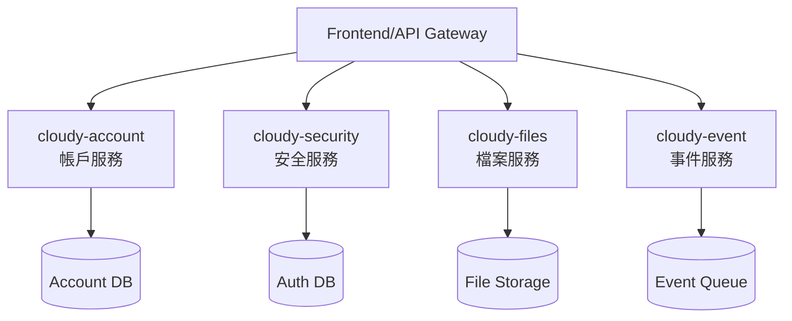

# 資源工具總覽

本頁面整合了AI驅動逆向工程教學所需的所有資源，包括範例專案、系統提示模板、學習素材等。

## 🎯 核心資源架構

### 📁 專案資源結構
```
pm-ai-driven-reverse-engineering/
├── 📚 tutorial-plan/              # 章節規劃指南
│   ├── 第01章-安裝與設定規劃指南.md
│   ├── 第02章-理解上下文規劃指南.md
│   └── ...
├── 🎯 tutorial-sample-project/    # Cloudy 微服務範例
│   ├── cloudy-account/           # 帳戶服務
│   ├── cloudy-security/          # 安全服務  
│   ├── cloudy-files/             # 檔案服務
│   └── cloudy-event/             # 事件服務
├── 🤖 reverse-system-prompt/      # AI系統提示模板
│   ├── analyzer-system.prompt.md
│   ├── documenter-system.prompt.md
│   └── ...
└── 📖 tutorial-material/          # 教學素材
    ├── Cursor編輯器安裝與設定指南.md
    ├── 掌握Cursor的核心-理解與活用上下文.md
    └── ...
```

## 🎯 Cloudy 微服務範例專案

### 專案概述
Cloudy 是一個基於 Spring Boot 的微服務架構專案，專為教學設計，涵蓋了現代企業應用的核心功能模組。

### 服務架構


### 🏠 [cloudy-account](./cloudy-account) - 帳戶服務
**功能**: 用戶註冊、登入、個人資料管理
**技術棧**: Spring Boot, Spring Data JPA, MySQL
**學習重點**: RESTful API 設計、資料庫操作、驗證機制

### 🔐 [cloudy-security](./cloudy-security) - 安全服務  
**功能**: JWT 認證、權限控制、安全策略
**技術棧**: Spring Security, JWT, Redis
**學習重點**: 安全架構、認證授權、會話管理

### 📁 [cloudy-files](./cloudy-files) - 檔案服務
**功能**: 檔案上傳、下載、管理、壓縮
**技術棧**: Spring Boot, MinIO, File Processing
**學習重點**: 檔案處理、物件儲存、非同步處理

### 📨 [cloudy-event](./cloudy-event) - 事件服務
**功能**: 事件發布、訂閱、通知推送
**技術棧**: Spring Boot, RabbitMQ, WebSocket
**學習重點**: 事件驅動架構、訊息佇列、即時通訊

## 🤖 AI 系統提示模板庫

### 模板分類

#### 📊 分析類模板
- **analyzer-system.prompt.md** - 程式碼結構分析
- **architecture-analyzer.prompt.md** - 系統架構分析  
- **dependency-analyzer.prompt.md** - 依賴關係分析
- **performance-analyzer.prompt.md** - 效能分析

#### 📝 文檔類模板  
- **documenter-system.prompt.md** - 技術文檔生成
- **api-documenter.prompt.md** - API 文檔生成
- **readme-generator.prompt.md** - README 生成
- **comment-generator.prompt.md** - 程式碼註解生成

#### 🛡️ 安全檢查模板
- **security_auth.prompt.md** - 安全認證檢查
- **vulnerability-scanner.prompt.md** - 漏洞掃描
- **code-security-review.prompt.md** - 程式碼安全審查

#### 📋 規劃類模板
- **planner-system.prompt.md** - 專案規劃
- **refactor-planner.prompt.md** - 重構規劃
- **migration-planner.prompt.md** - 遷移規劃

### [查看所有提示模板 →](./prompts)

## 📚 學習素材庫

### Cursor 編輯器相關
- **Cursor編輯器安裝與設定指南.md** - 完整安裝配置教學
- **掌握Cursor的核心-理解與活用上下文.md** - 上下文管理深度解析
- **CursorAsk模式深度解析.md** - 問答模式使用技巧
- **CursorAI-Agent功能詳解.md** - AI Agent 功能完全指南

### AI 程式碼分析技巧
- **程式碼閱讀策略與技巧.md** - 系統性程式碼閱讀方法
- **逆向工程思維建立.md** - 產品偵探思維培養
- **AI輔助程式碼重構.md** - 重構策略與實踐

### 實戰案例研究
- **微服務架構分析案例.md** - Cloudy 專案深度解析
- **安全架構分析實例.md** - 安全機制分析方法
- **效能最佳化案例.md** - 效能分析與優化實踐

### [查看所有學習素材 →](./cursor-guide)

## 🛠️ 開發工具推薦

### 必備工具
- **Cursor** - AI 驅動的程式碼編輯器
- **Git** - 版本控制系統
- **Docker** - 容器化平台（可選）
- **Postman** - API 測試工具

### 輔助工具
- **JetBrains IntelliJ IDEA** - Java 開發環境（備選）
- **MySQL Workbench** - 資料庫管理工具
- **Redis Desktop Manager** - Redis 管理工具
- **Sourcetree** - Git GUI 工具

### 瀏覽器插件
- **JSON Formatter** - JSON 格式化
- **React Developer Tools** - React 開發工具
- **Wappalyzer** - 技術棧識別

## 📖 外部資源連結

### 官方文檔
- [Cursor 官方文檔](https://cursor.sh/docs)
- [Spring Boot 官方指南](https://spring.io/guides)
- [OpenAI API 文檔](https://platform.openai.com/docs)

### 社群資源
- [GitHub - Cursor 社群](https://github.com/getcursor)
- [Spring Boot 中文社群](https://springboot.io/)
- [微服務架構最佳實踐](https://microservices.io/)

### 學習平台
- [Spring Academy](https://spring.academy/)
- [Baeldung Spring 教學](https://www.baeldung.com/spring-boot)
- [阮一峰的網路日誌](https://www.ruanyifeng.com/blog/)

## 🤝 資源貢獻

### 如何貢獻資源
1. **提交新的範例專案** - 基於實際業務場景
2. **分享系統提示模板** - 經過驗證的有效模板
3. **貢獻教學素材** - 高品質的學習內容
4. **回報資源問題** - 發現錯誤或過時資訊

### 貢獻指南
- 📝 [貢獻指南](../contributing)
- 🔍 [品質標準](../checkpoints/quality-standards)
- 💬 [討論區](https://github.com/your-username/pm-ai-driven-reverse-engineering/discussions)

---

## 🚀 開始使用資源

1. **選擇學習路徑** - 根據經驗選擇適合的章節
2. **下載範例專案** - 本地環境設置
3. **配置開發工具** - Cursor 編輯器設定
4. **開始第一章** - [安裝與設定](../guide/ch01)

**充分利用這些資源，開始您的AI驅動逆向工程學習之旅！** 🚀 