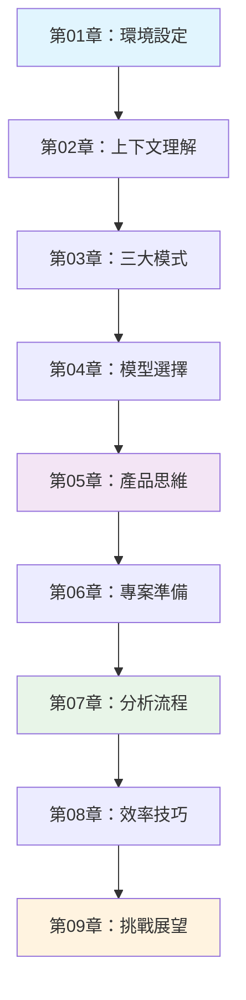

# AI驅動逆向工程教學計畫指南

## 專案概述

本教學計畫旨在教導產品經理和開發者如何運用AI工具（特別是Cursor編輯器）進行有效的程式碼逆向工程和系統分析。透過9個循序漸進的章節，學習者將掌握從基礎設定到進階分析的完整技能。

## 教學目標

- 建立AI驅動的程式碼分析思維
- 掌握Cursor編輯器的進階功能
- 學會系統性分析既有程式碼
- 培養產品偵探的洞察能力
- 建立高效的專案逆向工程流程

## 章節架構

### 第01章：安裝與設定規劃指南
**目標**：建立完整的開發環境
- Cursor編輯器安裝與基本設定
- AI模型配置與API設定
- 必要擴充套件安裝
- 環境變數設定
- 基本使用測試

**實作要求**：
- 提供詳細的安裝步驟截圖
- 建立設定檢查清單
- 提供常見問題排除指南

### 第02章：理解上下文規劃指南
**目標**：深度理解Cursor的上下文機制
- 上下文的概念與重要性
- 如何有效收集程式碼上下文
- 上下文視窗的管理技巧
- 多檔案關聯分析
- 上下文優化策略

**實作要求**：
- 示範上下文收集的最佳實務
- 提供上下文管理工具
- 建立上下文品質評估標準

### 第03章：三大核心模式規劃指南
**目標**：掌握AI輔助程式碼分析的核心模式
- **分析模式**：程式碼結構與邏輯分析
- **文件模式**：自動生成技術文件
- **重構建議模式**：程式碼優化建議

**實作要求**：
- 詳細說明每種模式的使用時機
- 提供模式切換的實際範例
- 建立模式效果評估指標

### 第04章：AI模型選擇規劃指南
**目標**：選擇適合的AI模型進行不同任務
- GPT-4、Claude、Gemini等模型比較
- 不同任務的模型選擇策略
- 成本效益分析
- 模型性能基準測試
- 自定義模型配置

**實作要求**：
- 建立模型選擇決策樹
- 提供性能測試腳本
- 建立成本追蹤表格

### 第05章：產品偵探思維規劃指南
**目標**：培養系統性的程式碼分析思維
- 產品需求反推技巧
- 業務邏輯識別方法
- 資料流向追蹤
- 用戶行為路徑分析
- 系統架構推導

**實作要求**：
- 建立分析思維框架
- 提供實際案例分析
- 建立分析報告模板

### 第06章：專案準備規劃指南
**目標**：建立標準化的專案分析流程
- 專案資料收集清單
- 初步分析檢查點
- 分析優先順序設定
- 團隊協作機制
- 文件化標準

**實作要求**：
- 建立專案準備檢查表
- 提供團隊協作工具
- 建立標準化模板

### 第07章：黃金分析流程規劃指南
**目標**：建立高效的程式碼分析標準流程
- 快速系統概覽技巧
- 關鍵模組識別方法
- 深度分析策略
- 問題發現與記錄
- 改善建議產出

**實作要求**：
- 建立標準分析流程圖
- 提供流程執行檢查點
- 建立品質控制機制

### 第08章：進階效率技巧規劃指南
**目標**：掌握提升分析效率的進階技巧
- 批次處理技巧
- 自動化腳本開發
- 快捷鍵與工作流程優化
- 多專案管理策略
- 效率度量與改進

**實作要求**：
- 提供自動化腳本範例
- 建立效率度量儀表板
- 建立個人化設定指南

### 第09章：挑戰與展望規劃指南
**目標**：應對實際挑戰並展望未來發展
- 常見挑戰與解決方案
- 最佳實務案例分享
- 技術發展趋勢分析
- 持續學習路徑
- 社群與資源

**實作要求**：
- 建立挑戰解決方案庫
- 提供持續學習計畫
- 建立社群參與指南

## 每章節實作規範

### 內容結構要求
1. **概念說明**（20%）：理論基礎與核心概念
2. **實際操作**（50%）：詳細的步驟與範例
3. **實戰演練**（20%）：基於tutorial-sample-project的練習
4. **總結與檢查**（10%）：學習成果驗證

### 範例專案使用
- 每章都應基於`tutorial-sample-project`中的cloudy微服務專案
- 提供實際的程式碼分析範例
- 展示真實場景的應用

### 系統提示使用
- 活用`reverse-system-prompt`目錄中的各種提示模板
- 為每個分析任務選擇適當的系統提示
- 展示如何自定義系統提示

### 教學材料整合
- 整合`tutorial-material`中的Cursor使用指南
- 提供相關的技術文件連結
- 建立知識點的交叉參照

## 品質標準

### 內容品質
- 每章至少3000字的詳細內容
- 包含至少5個實際操作範例
- 提供完整的程式碼片段和截圖

### 實用性
- 所有範例都能在實際環境中執行
- 提供可驗證的學習成果
- 建立實用的工具和模板

### 連貫性
- 章節間的知識點串聯
- 從基礎到進階的漸進式學習
- 一致的術語和格式使用

## Claude Code 實作指示

### 撰寫順序
請按照章節順序依次完成，每章完成後進行審查和測試。

### 實作重點
1. 每章都要有實際可操作的範例
2. 基於真實專案場景設計練習
3. 提供詳細的步驟說明和截圖
4. 包含疑難排解和最佳實務建議

### 驗收標準
- 內容完整度：是否涵蓋所有規劃要點
- 實用性：是否提供可執行的範例
- 清晰度：是否易於理解和跟隨
- 一致性：是否符合整體架構

## 學習路徑

## 預期學習成果

完成本教學計畫後，學習者將能夠：
- 熟練使用Cursor進行AI驅動的程式碼分析
- 建立系統性的逆向工程思維
- 快速理解和分析既有程式碼系統
- 提供有價值的程式碼改善建議
- 建立高效的團隊協作流程

---

**注意**：請Claude Code嚴格按照此指南完成每個章節的詳細內容，確保教學的完整性和實用性。
